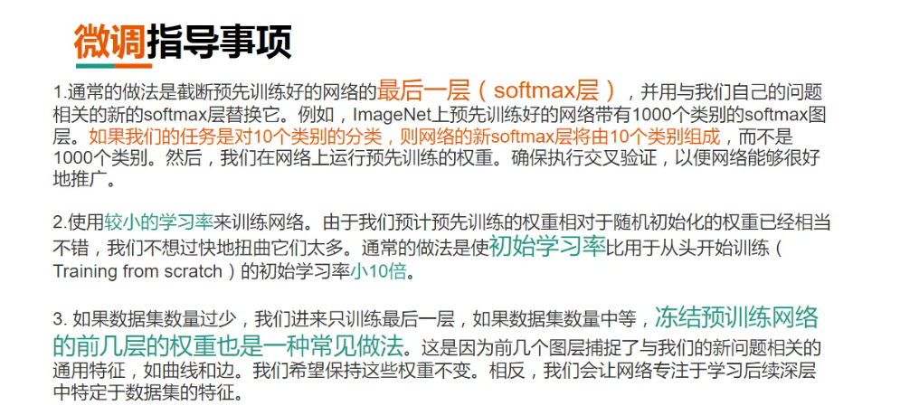
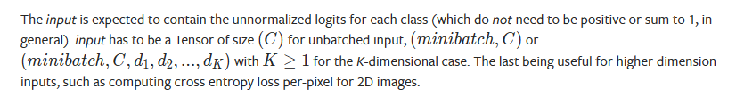

## 参考文献

1. [Residual blocks — Building blocks of ResNet | by Sabyasachi Sahoo | Towards Data Science](https://towardsdatascience.com/residual-blocks-building-blocks-of-resnet-fd90ca15d6ec)

# GPT-frontend 

2023-3

## 问题

- [x] Ubuntu18.04中的cmake版本已经落后最新tvm的cmake需求

​	解决方案：dockerfile中进行cmake的重装

- [x] tvm第三方库丢失

​	解决方案：git clone --recursive xx

​	选项`--recursive`用于获取 TVM 的依赖（位于 tvm/3rdparty 目录下）的源码。

- [x] git速度慢

​	解决方案：proxy，v2ray中开启“全局规则”，参数设置中“允许局域网连接”

- [x] 对cmake.config的一些改动

​	set(CMAKE_BUILD_TYPE "Debug")

​	set(USE_LLVM /llvm/clang+llvm-10.0.0-x86_64-linux-gnu-ubuntu-18.04/bin/llvm-config) 非常重要

- [x] 配置docker中ssh连接github 仓库gpt-frontend

  已成功，不过docker中的isa能不能后续使用还没测试；

  WSL本地目前只有一份isa，名为gpt，另外的note的isa已被覆盖，但因为主机desktop可以正常使用，所以该isa不需要；

- [x] vscode源代码上传git提交测试

  已成功，速度很快，省去了命令行操作
  
- [ ] 无法在WSL内使用cuda

  通过docker-gpu生成带cuda的docker环境，但失败

- [ ] nvcc fatal: Unsupported gpu architecture 'compute_86'

- [x] 以上两个问题均来源于docker cuda环境配置报错，问题完全解决方案见[tvm docker cuda环境配置.md]文件。

## 笔记

bert采用编码器，是因为其所采用的训练方式是完形填空，需要知道过去和未来两个时刻的信息才能填补所缺信息；gpt采用解码器，想要解决的问题是预测未来，故利用解码器的mask机制，并保证k窗口大小来对未来进行预测。

Concept：

微调：在已有预训练模型的基础上进行训练以达到最优效果。

预训练模型：预训练模型是经过了大型数据集训练过的、已经具备提取浅层基础特征和深层抽象特征的能力的模型。

在以下情况下使用微调：1）自身微调任务与预训练模型数据集相似，2）自身模型正确率太低，3）数据集数量太少，4）计算资源太少



gpt的QA相当于是对于给定squence，输出squence之后的内容（这些内容就是对于给定squence的answer）

### nanoGPT

[gpt-dev.ipynb - Colaboratory (google.com)](https://colab.research.google.com/drive/1JMLa53HDuA-i7ZBmqV7ZnA3c_fvtXnx-?usp=sharing#scrollTo=TD5Bj8Y6IAD4)

```python
chars = sorted(list(set(text)))
'''
set取出text中所有出现的字符（去重），将结果作为列表后排序，得到chars
chars = ['\n', ' ', '!', '$', '&', "'", ',', '-', '.', '3', ':', ';', '?', 'A', 'B', 'C', 'D', 'E', 'F', 'G', 'H', 'I', 'J', 'K', 'L', 'M', 'N', 'O', 'P', 'Q', 'R', 'S', 'T', 'U', 'V', 'W', 'X', 'Y', 'Z', 'a', 'b', 'c', 'd', 'e', 'f', 'g', 'h', 'i', 'j', 'k', 'l', 'm', 'n', 'o', 'p', 'q', 'r', 's', 't', 'u', 'v', 'w', 'x', 'y', 'z']
，其中包括空格，回车等；
print(''.join(chars)) =  !$&',-.3:;?ABCDEFGHIJKLMNOPQRSTUVWXYZabcdefghijklmnopqrstuvwxyz
即出现的字符的列表（按ASCII码排序）
'''

stoi = { ch:i for ch, i in enumerate(chars)}
```

tokenizer，openai采用sub-word level（以一个单词为一个最小单元，记录下标）而nanoGPT采用character level（以一个字符为最小单元记录下标），这样sub-word level的decoder和encoder变得很复杂（要针对word-level），但是encode一个句子，句子的长度就很短（句子encode的长度即句子中单词的个数）；而character level则相反，一个句子所有的字符数量就是这个句子encode后的长度。

```python
import torch # we use PyTorch: https://pytorch.org
data = torch.tensor(encode(text), dtype=torch.long)
print(data.shape, data.dtype)
print(data[:1000]) # the 1000 characters we looked at earier will to the GPT look like this
```

将text解码为data，text1000为word-level，data1000为char-level；

以9：1的比例将data分为train and test两部分使用；

将data以chunk即block大小放入transformers中，当block设定为8时，train_data大小为block_size+1，是因为以第一个字符为基准，对后面八个字符进行预测：

```python
x = train_data[:block_size]
y = train_data[1:block_size+1]
for t in range(block_size):
    context = x[:t+1]
    target = y[t]
    print(f"when input is {context} the target: {target}")
    
'''
when input is tensor([18]) the target: 47
when input is tensor([18, 47]) the target: 56
when input is tensor([18, 47, 56]) the target: 57
when input is tensor([18, 47, 56, 57]) the target: 58
when input is tensor([18, 47, 56, 57, 58]) the target: 1
when input is tensor([18, 47, 56, 57, 58,  1]) the target: 15
when input is tensor([18, 47, 56, 57, 58,  1, 15]) the target: 47
when input is tensor([18, 47, 56, 57, 58,  1, 15, 47]) the target: 58
'''
```

| Chunk     | 窗口大小，每次传给Transformer预测的文本大小 |
| --------- | ------------------------------------------: |
| **Batch** |          **利用GPU进行并行运算的Chunk数量** |

```python
def get_batch(split):
    # generate a small batch of data of inputs x and targets y
    data = train_data if split == 'train' else val_data
    ix = torch.randint(len(data) - block_size, (batch_size,))
    # len(data) - block_size作为生成随机数的上界，下界缺省默认为0，生成batch_size个
    x = torch.stack([data[i:i+block_size] for i in ix])
    y = torch.stack([data[i+1:i+block_size+1] for i in ix])
    return x, y
```

使用nn.Embedding后token_embedding_table shape为(B,T,C)，C即词汇表中表示一个词所用的维度，embedding中参数设定nn.Embedding(num_embeddings, embedding_dim)，前者为词汇表大小，后者为维度大小。

F.cross_entropy所需要的格式是BCD，故改写格式，将BT维度合并，拉伸成一个维度，C作为第二维度：

```python
B, T, C = logits.shape
logits = logits.view(B*T, C)
targets = targers.view(B*T) # or (-1)
```



`idx_next = torch.multinomial(probs, num_samples=1) # (B, 1)`随机取样，不放回在input（即probs）里取数，大小作为概率，返回取的数的下标。

```python
print(decode(m.generate(torch.zeros((1, 1), dtype=torch.long), max_new_tokens=100)[0].tolist()))
```

其中`torch.zeros((1, 1)`作为初始idx，表示batch为1，第一个时刻，此时没有targets，generate过程中idx变化如下：

```
tensor([[ 0, 31]])
tensor([[ 0, 31, 23]])
tensor([[ 0, 31, 23, 21]])
tensor([[ 0, 31, 23, 21, 41]])
tensor([[ 0, 31, 23, 21, 41, 24]])
tensor([[ 0, 31, 23, 21, 41, 24, 32]])
tensor([[ 0, 31, 23, 21, 41, 24, 32, 11]])
tensor([[ 0, 31, 23, 21, 41, 24, 32, 11, 13]])
...
```

生成100个token，返回idx最后维度为(1, 101)，可以理解为二维数组，有1行101列，[0]取第1行，由于是tensor转化为list后decode解码。

AdamW优化器

```python
optimizer.zero_grad(set_to_none=True) # 将梯度置0
loss.backward() # 反向传播获得参数
optimizer.step() # 更新参数
```

利用preview信息取平均来进行预测，构造取平均后的mask矩阵

```python
# VERSION 1
wei = torch.tril(torch.ones(T, T))
wei = wei / wei.sum(1, keepdim=True)
xbow2 = wei @ x # (B, T, T) @ (B, T, C) ----> (B, T, C) broadcast

tensor([[1.0000, 0.0000, 0.0000, 0.0000, 0.0000, 0.0000, 0.0000, 0.0000],
        [0.5000, 0.5000, 0.0000, 0.0000, 0.0000, 0.0000, 0.0000, 0.0000],
        [0.3333, 0.3333, 0.3333, 0.0000, 0.0000, 0.0000, 0.0000, 0.0000],
        [0.2500, 0.2500, 0.2500, 0.2500, 0.0000, 0.0000, 0.0000, 0.0000],
        [0.2000, 0.2000, 0.2000, 0.2000, 0.2000, 0.0000, 0.0000, 0.0000],
        [0.1667, 0.1667, 0.1667, 0.1667, 0.1667, 0.1667, 0.0000, 0.0000],
        [0.1429, 0.1429, 0.1429, 0.1429, 0.1429, 0.1429, 0.1429, 0.0000],
        [0.1250, 0.1250, 0.1250, 0.1250, 0.1250, 0.1250, 0.1250, 0.1250]])


# VERSION 2 Use softmax
tril = torch.tril(torch.ones(T, T))
wei = torch.zeros((T,T)) # 表明字符与字符之间还未有联系
wei = wei.masked_fill(tril == 0, float('-inf')) # 表明未来的信息无法访问，不可达
'''
tensor([[0., -inf, -inf, -inf, -inf, -inf, -inf, -inf],
        [0., 0., -inf, -inf, -inf, -inf, -inf, -inf],
        [0., 0., 0., -inf, -inf, -inf, -inf, -inf],
        [0., 0., 0., 0., -inf, -inf, -inf, -inf],
        [0., 0., 0., 0., 0., -inf, -inf, -inf],
        [0., 0., 0., 0., 0., 0., -inf, -inf],
        [0., 0., 0., 0., 0., 0., 0., -inf],
        [0., 0., 0., 0., 0., 0., 0., 0.]])
'''
wei = F.softmax(wei, dim=-1) # 强调字符之间的联系，-inf为0，0为1，后正则化
'''
tensor([[1.0000, 0.0000, 0.0000, 0.0000, 0.0000, 0.0000, 0.0000, 0.0000],
        [0.5000, 0.5000, 0.0000, 0.0000, 0.0000, 0.0000, 0.0000, 0.0000],
        [0.3333, 0.3333, 0.3333, 0.0000, 0.0000, 0.0000, 0.0000, 0.0000],
        [0.2500, 0.2500, 0.2500, 0.2500, 0.0000, 0.0000, 0.0000, 0.0000],
        [0.2000, 0.2000, 0.2000, 0.2000, 0.2000, 0.0000, 0.0000, 0.0000],
        [0.1667, 0.1667, 0.1667, 0.1667, 0.1667, 0.1667, 0.0000, 0.0000],
        [0.1429, 0.1429, 0.1429, 0.1429, 0.1429, 0.1429, 0.1429, 0.0000],
        [0.1250, 0.1250, 0.1250, 0.1250, 0.1250, 0.1250, 0.1250, 0.1250]])
'''
xbow3 = wei @ x
torch.allclose(xbow, xbow3)
```

### GPT

- GPT 最大的问题就是传统的语言模型是单向的；我们根据之前的历史来预测当前词。但是我们不能利用后面的信息。比如句子 The animal didn’t cross the street because it was too tired。我们在编码 it 的语义的时候需要同时利用前后的信息，因为在这个句子中，it 可能指代 animal 也可能指代 street。根据 tired，我们推断它指代的是 animal。但是如果把 tired 改成 wide，那么 it 就是指代 street 了。Transformer 的 Self-Attention 理论上是可以同时关注到这两个词的，但是根据前面的介绍，为了使用 Transformer 学习语言模型，必须用 Mask 来让它看不到未来的信息，所以它也不能解决这个问题。
- GPT在tvm前端优化无需进行微调，只需要测试pre-trained model在优化前和优化后的inference时间即可。
- 线性增加loss需要指数增加计算量、数据量