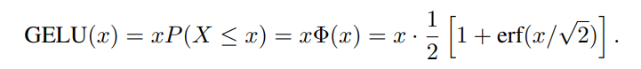
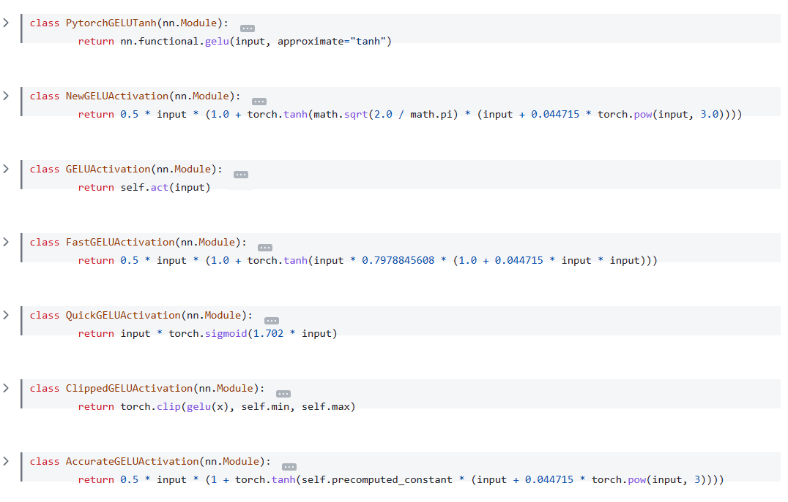
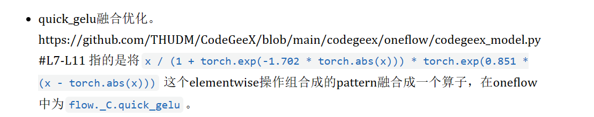

# Ops 笔记

## GELU

GELU(Gaussian Error Linear Unit，高斯误差线性单元)激活函数的定义利用的是门控机制，有`GELU=xP(X<=x)`，即：



BERT中最先使用的便是非近似表示：

```python
def _gelu_python(self, input: Tensor) -> Tensor:
        return input * 0.5 * (1.0 + torch.erf(input / math.sqrt(2.0)))
```

目前实际应用中一般用近似函数来表示：


在oneflow中的new_GELU算子实现中，原GELU的实现为

```python
x / (1 + torch.exp(-1.702 * torch.abs(x))) * torch.exp(0.851 * (x - torch.abs(x)))
```

这对应的是GELU近似的第二种，其中σ函数一般可以选择与正态分布的累积分布较为近似的函`sigmoid(x)=1/(1+e^(-x))`来表示，目前不清楚后面那一项是什么。、

在transformers中GELU的实现如下：

```python
class NewGELUActivation(nn.Module):
    """
    Implementation of the GELU activation function currently in Google BERT repo (identical to OpenAI GPT). Also see
    the Gaussian Error Linear Units paper: https://arxiv.org/abs/1606.08415
    """

    def forward(self, input: Tensor) -> Tensor:
        return 0.5 * input * (1.0 + torch.tanh(math.sqrt(2.0 / math.pi) * (input + 0.044715 * torch.pow(input, 3.0))))
```

采取的便是第一种近似。

[transformers/src/transformers/activations.py](https://github.com/huggingface/transformers/blob/main/src/transformers/activations.py)中也列举了其他一些GELU变体：



CodeGeeX中使用oneflow进行后端推理，其优化中有关于GELU的融合优化，但目前没找到具体代码实现。



参见[CodeGeeX 130亿参数大模型的调优笔记：比FasterTransformer更快的解决方案 (qq.com)](https://mp.weixin.qq.com/s/GpDZhiyCdnhmPdL2nlXlmw)