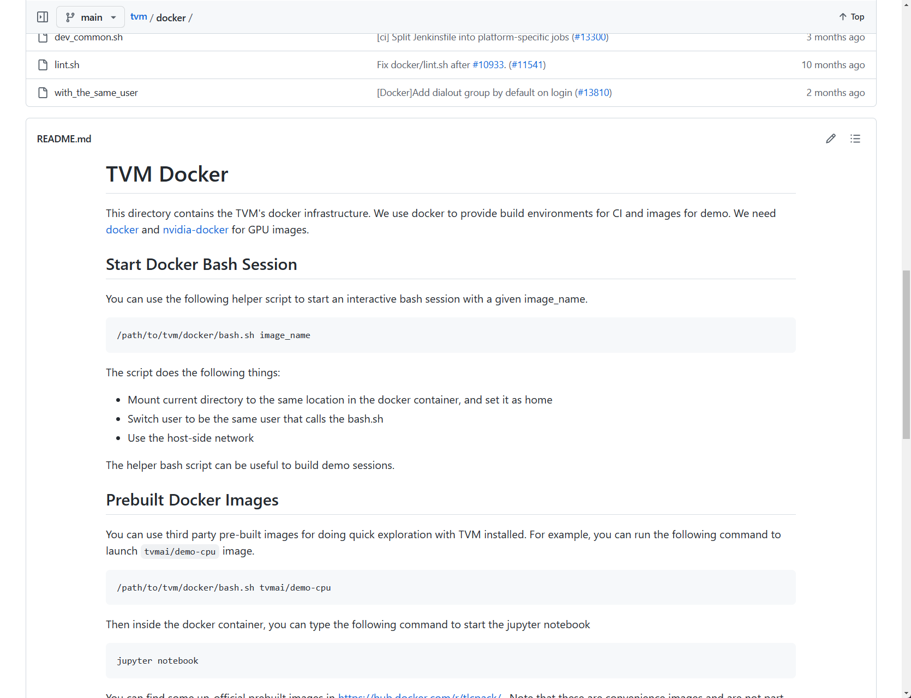

# TVM docker cuda环境配置最新方案

2023-3-22

从外部docker创建环境的方式会导致tvm的各种依赖不满足条件的问题，采用tvm/docker中的GPU images，网址为[tvm/docker at main · apache/tvm (github.com)](https://github.com/apache/tvm/tree/main/docker)。



使用Dockerfile.ci_gpu，并且进行一些个性化更改，更改文件见[code/docker/Dockerfile.ci_gpu]。用该文件替换tvm/docker下的同名文件，其余无需修改。

#### 环境创建

进入本地tvm文件夹（注意不是docker文件夹下），输入

```
./docker/build.sh ci_gpu
```

等待docker build完成，过程可能因为网络波动导致安装失败，一种方法是多尝试几次（玄学），另一种是在WSL2下安装代理，安装代理方式参考先前文章或谷歌（这里建议使用clash而非v2ray，注意开启全局代理和允许局域网访问等）。


安装完毕后输入

```
./docker/bash.sh tvm.ci_gpu --mount "($pwd)"
```

进入docker环境且挂载到本地目录下，进入vscode远程管理器，选择tvm.ci_gpu容器，点击attach new window：


选择文件夹，选择到tvm/..即上级目录，确认即可：


docker内的python环境采用venv中的apache-tvm-py3.7虚拟环境，激活后手动选择python路径

最后需要手动安装的有

```
sudo apt-get install transformers
sudo apt-get install ssh
```

等其他需要安装的包。