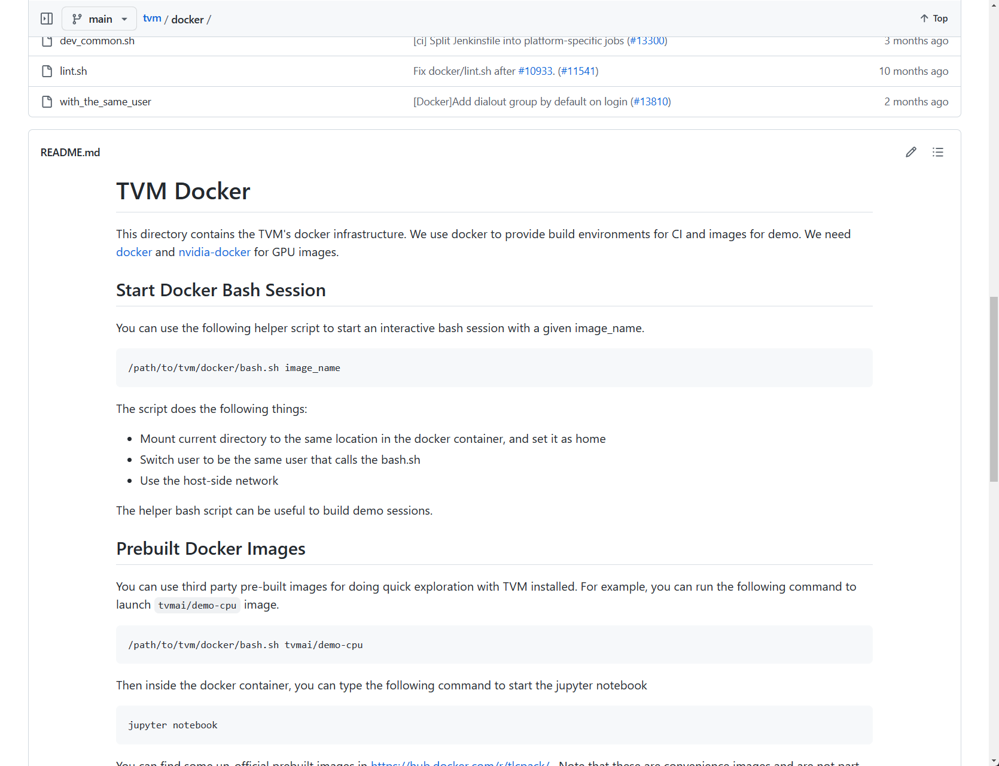
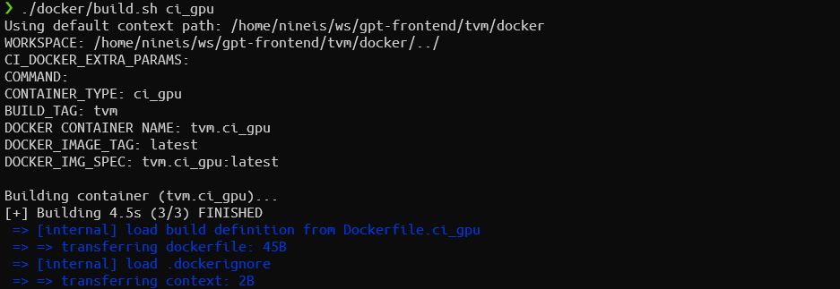
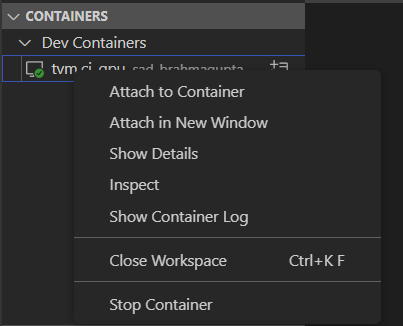
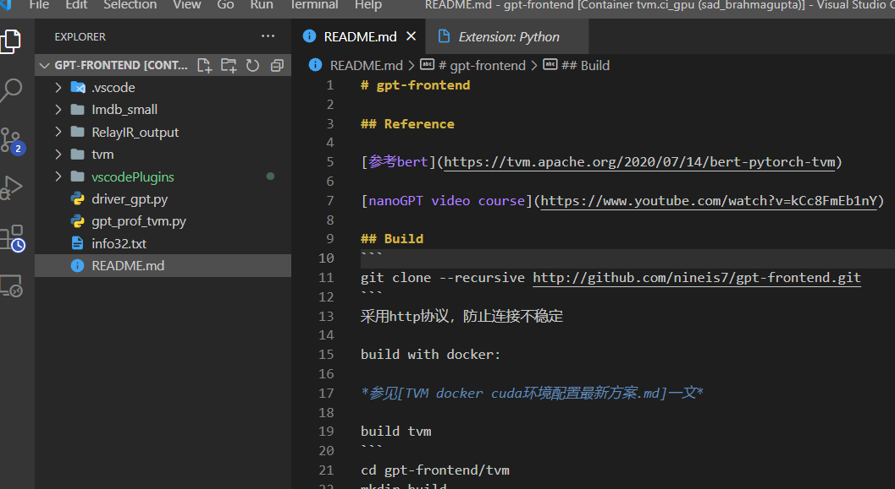
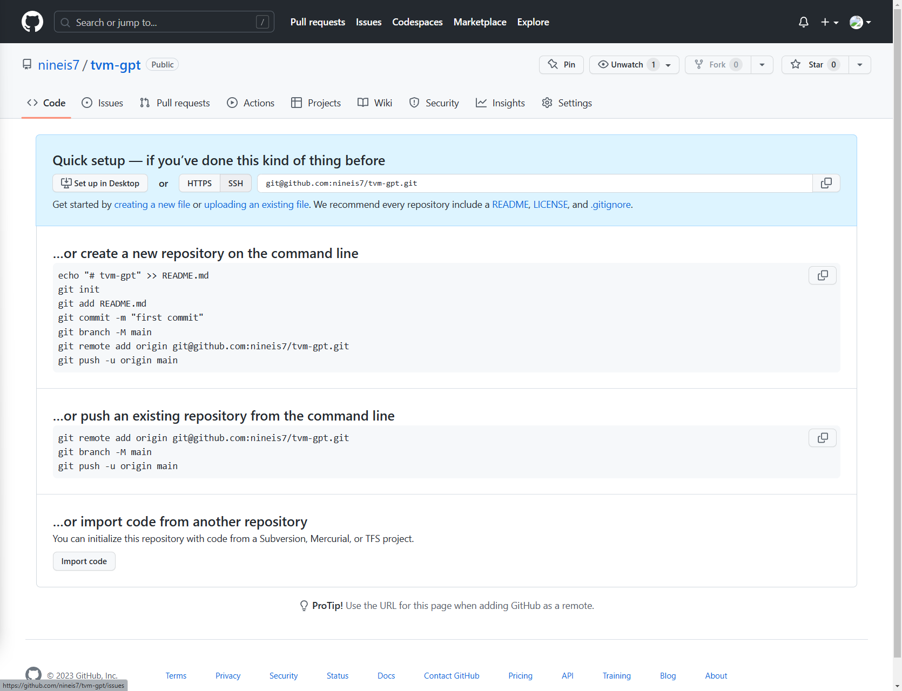

[TOC]

# TVM docker cuda环境配置最新方案

2023-3-22

从外部docker创建环境的方式会导致tvm的各种依赖不满足条件的问题，采用tvm/docker中的GPU images，网址为[tvm/docker at main · apache/tvm (github.com)](https://github.com/apache/tvm/tree/main/docker)。



使用Dockerfile.ci_gpu，并且进行一些个性化更改，更改文件见[code/docker/Dockerfile.ci_gpu]。用该文件替换tvm/docker下的同名文件，其余无需修改。

#### 环境创建

进入本地tvm文件夹（注意不是docker文件夹下），输入

```
./docker/build.sh ci_gpu
```

等待docker build完成，过程可能因为网络波动导致安装失败，一种方法是多尝试几次（玄学），另一种是在WSL2下安装代理，安装代理方式参考先前文章或谷歌（这里建议使用clash而非v2ray，注意开启全局代理和允许局域网访问等）。



安装完毕后输入

```
./docker/bash.sh tvm.ci_gpu --mount "($pwd)"
or ./docker/bash.sh tvm.ci_gpu --mount="/home/nineis/ws/gpt-frontend"
```

进入docker环境且挂载到本地目录下，进入vscode远程管理器，选择tvm.ci_gpu容器，点击Attach in New Window：



选择文件夹，选择到tvm/..即上级目录，确认即可：



docker内的python环境采用venv中的apache-tvm-py3.7虚拟环境，激活后手动选择python路径

最后需要手动安装的有

```
sudo pip install transformers
sudo pip install datasets
sudo apt-get install ssh
```

等其他需要安装的包。

#### github备份

先在环境内生成并保存SSH key

```
ssh-keygen -t rsa
cat ~/.ssh/id_rsa.pub
```

复制内容，到github主页设置里新建新的SSH key，生成后在本地进行ssh测试

```
ssh -T git@github.com
```

能通说明key有效；

输入自己的github账户信息

```
sudo git config --global user.name "yourname"
sudo git config --global user.email "youremail"
```

在github主页新建repo，按照repo上的command line走：



注意在tvm docker环境内，除了最后一句`git push -u origin main`不需要加`sudo`其他command均需要加`sudo`;

#### tvm去除submodule

删去tvm里面git的所有配置文件，重新`git init`即可。

#### .gitignore

build tvm后生成的build文件夹是没有办法上传github的，此时需要在工作目录下新建.gitignore文件，添加

```
# 忽略build文件夹
/tvm/build
```

即可不上传build文件夹。

#### build with PAPI 

见PAPI.md