[TOC]

# Transformers 推导与细节笔记

​																																										-- 2023.2

本篇文章基于[annotated-transformer](http://nlp.seas.harvard.edu/annotated-transformer/)的第一部分Model Architecture所做的综合笔记，代码的实现不止一种，网络上有其他更简明的且易于实现的，可以用以对pre-training过程进行了解。该笔记中的code仅作为一种深入理解model原理和机制的工具，并不作为实际training的code，故该篇文章后面两部分的内容或缺省或由其他笔记补充。

## 参考文献

#### blog

1. [annotated-transformer](http://nlp.seas.harvard.edu/annotated-transformer/)
2. [The Illustrated Transformer](https://jalammar.github.io/illustrated-transformer/)
3. [ 图解Transformer（完整版）](https://blog.csdn.net/longxinchen_ml/article/details/86533005)
4. [Transformer的Decoder的输入输出](https://www.zhihu.com/question/337886108)
5. [Transformer模型详解（李宏毅版）](https://zhuanlan.zhihu.com/p/338817680)
6. [详解Self-Attention和Multi-Head Attention](https://imzhanghao.com/2021/09/15/self-attention-multi-head-attention/)
7. [Transformer代码阅读](http://fancyerii.github.io/2019/03/09/transformer-codes/)
8. [面经：什么是Transformer位置编码？](https://zhuanlan.zhihu.com/p/398457641)
9. [Transformer Architecture: The Positional Encoding](https://kazemnejad.com/blog/transformer_architecture_positional_encoding/)
10. [Linear Relationships in the Transformer’s Positional Encoding](https://timodenk.com/blog/linear-relationships-in-the-transformers-positional-encoding/)
10. [【Transformer】10分钟学会Transformer | Pytorch代码讲解 | 代码可运行](https://zhuanlan.zhihu.com/p/403433120)


#### Paper

1. [Attention Is All You Need](https://arxiv.org/pdf/1706.03762.pdf)
2. [Generating Sequences With Recurrent Neural Networks(自回归属性)](https://arxiv.org/pdf/1308.0850.pdf)
3. [Dropout](https://jmlr.org/papers/volume15/srivastava14a/srivastava14a.pdf)
4. [Positional Encoding](https://arxiv.org/pdf/1705.03122.pdf)
5. [Residual Connection](https://arxiv.org/pdf/1512.03385.pdf)
6. [Layer Normalization](https://arxiv.org/pdf/1607.06450.pdf)


#### 模型方面TODO

- [x] Positional Encoding原理
- [x] encoder-decoder整体流程
- [x] LN、dropout、resnet paper reading
- [x] model training part
- [ ] 李宏毅课


transformers总体布局如下，共分为五个部分：Encoder，Decoder，Inputs Embedding，Output Embedding和Geneator。

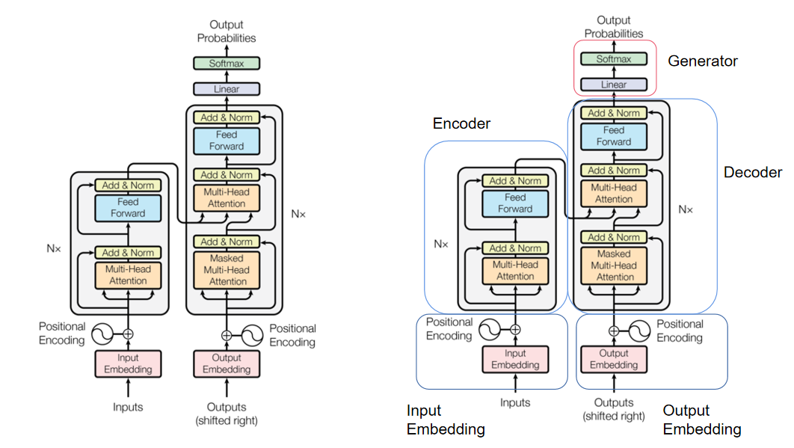

## EncoderDecoder class

```python
class EncoderDecoder(nn.Module):
    """
    A standard Encoder-Decoder architecture. Base for this and many
    other models.
    """

    def __init__(self, encoder, decoder, src_embed, tgt_embed, generator):
        super(EncoderDecoder, self).__init__()
        # 类成员，同样也是类
        self.encoder = encoder
        self.decoder = decoder
        self.src_embed = src_embed
        self.tgt_embed = tgt_embed
        self.generator = generator

    def forward(self, src, tgt, src_mask, tgt_mask):
        '调用时执行encode和decode function'
        "Take in and process masked src and target sequences."
        return self.decode(self.encode(src, src_mask), src_mask, tgt, tgt_mask)

    def encode(self, src, src_mask):
        return self.encoder(self.src_embed(src), src_mask)

    def decode(self, memory, src_mask, tgt, tgt_mask):
        return self.decoder(self.tgt_embed(tgt), memory, src_mask, tgt_mask)
```

初始化：

- self.encoder 编码器结构
- self.decoder 解码器结构
- self.src_embed 源嵌入
- self.tgt_embed 汇嵌入
- self.generator 生成器

在后续make_model function中通过如下语句调用生成实例：

```python
def make_model(
    src_vocab, tgt_vocab, N=6, d_model=512, d_ff=2048, h=8, dropout=0.1
):
    "Helper: Construct a model from hyperparameters."
    c = copy.deepcopy
    attn = MultiHeadedAttention(h, d_model)
    ff = PositionwiseFeedForward(d_model, d_ff, dropout)
    position = PositionalEncoding(d_model, dropout)
    model = EncoderDecoder(
        Encoder(EncoderLayer(d_model, c(attn), c(ff), dropout), N),
        Decoder(DecoderLayer(d_model, c(attn), c(attn), c(ff), dropout), N),
        nn.Sequential(Embeddings(d_model, src_vocab), c(position)),
        nn.Sequential(Embeddings(d_model, tgt_vocab), c(position)),
        Generator(d_model, tgt_vocab),
    )
    ...
```

后面对各部分进行分析。

## Generator

```python
class Generator(nn.Module):
    "Define standard linear + softmax generation step."

    def __init__(self, d_model, vocab):
        super(Generator, self).__init__()
        self.proj = nn.Linear(d_model, vocab)
        #nn.Linear(in_features, out_features)二维张量变换

    def forward(self, x):
        return log_softmax(self.proj(x), dim=-1)
```

生成器模块做的是线性变换+softmax，该部分位于Decoder输出后和最终输出Output Probabilities之间，作用是将decoder的隐状态输出对应的词，其中d_model为Decoder输出的大小，vocab为词典的大小，`nn.Linear(d_model, vocab)`便是利用全连接来将decoder输出转化为词表大小的结果，并通过softmax转化为每一个词的概率。

#### nn.Linear使用补充

self.proj = nn.Linear(d_model, vocab)用法细节补充：

> 1）nn.Linear是一个类，使用时进行类的实例化；
>
> <u>PS: 这里注意python中class和function在书写上区别不大，但在使用上有差异。后者是调用，前者是实例化。</u>
>
> 2）实例化的时候，nn.Linear需要输入两个参数，in_features为上一层神经元的个数，out_features为这一层的神经元个数，batch不变（batch相当于除最后一位维度大小的其他位），参考使用例。
>
> 3）不需要定义w和b。所有nn.Module的子类，形如nn.XXX的层，都会在实例化的同时**随机生成**w和b的初始值。所以实例化之后，我们就可以调用属性weight和bias来查看生成的w和b。其中w是必然会生成的，b可以控制是否生成。在nn.Linear类中，有参数bias，默认 bias = True。如果不拟合常量b，在实例化时将参数bias设置为False即可。
>
> 4）由于w和b是随机生成的，所以同样的代码多次运行后的结果是不一致的。如果我们希望控制随机性，则可以使用torch中的random类。如：torch.random.manual_seed(420) #人为设置随机数种子
>
> 5）由于不需要定义常量b，因此在特征张量中，不需要留出与常数项相乘的那一列，只需要输入特征张量。
>
> 6）输入层只有一层，并且输入层的结构（神经元的个数）由输入的特征张量X决定，因此在PyTorch中构筑神经网络时，不需要定义输入层。
>
> 7）实例化之后，将特征张量输入到实例化后的类中。

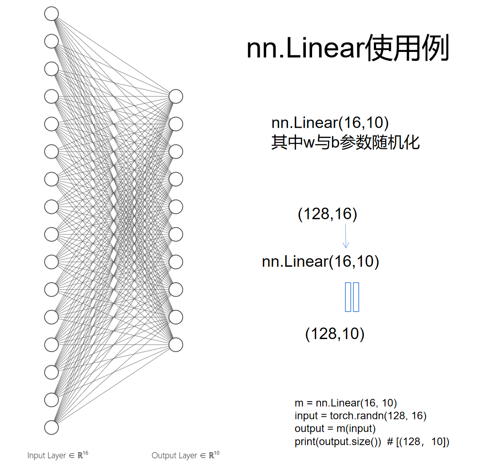

#### forward执行顺序问题

python class的调用过程跟C++相似，如下情况当运行```a = Children()```即实例化时，执行class中的```__init__```function，再执行基类Foo。

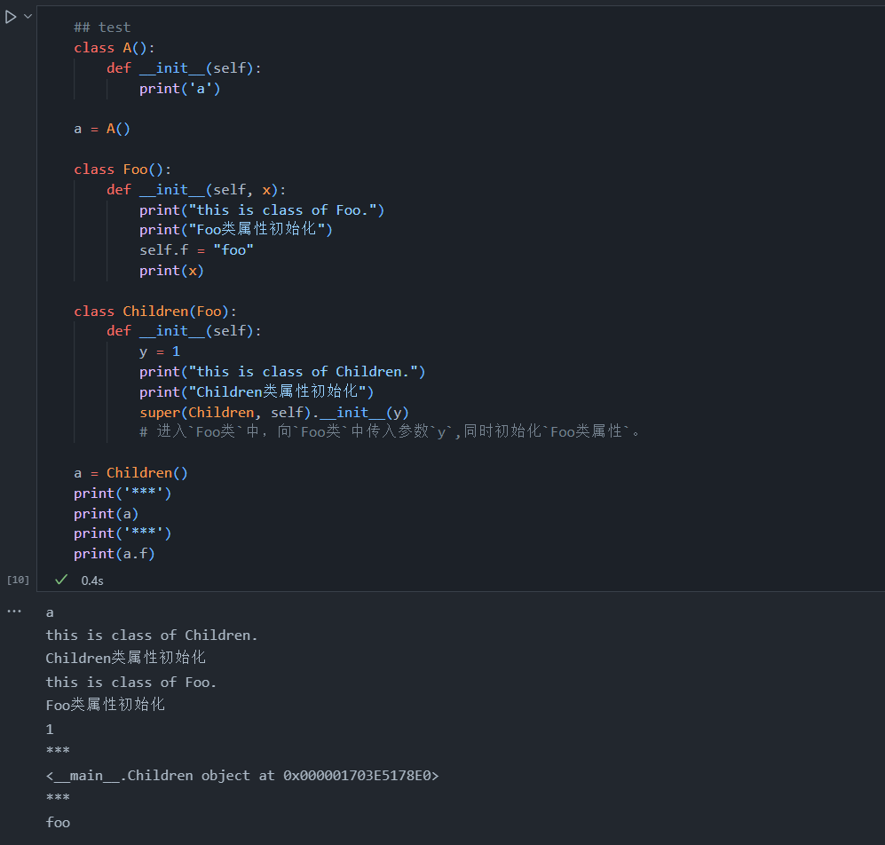

除了```__init__```function，还有```__call__```function，该function只有在实例被调用时才被运行。而forward便是依据```__call__```function来调用的：

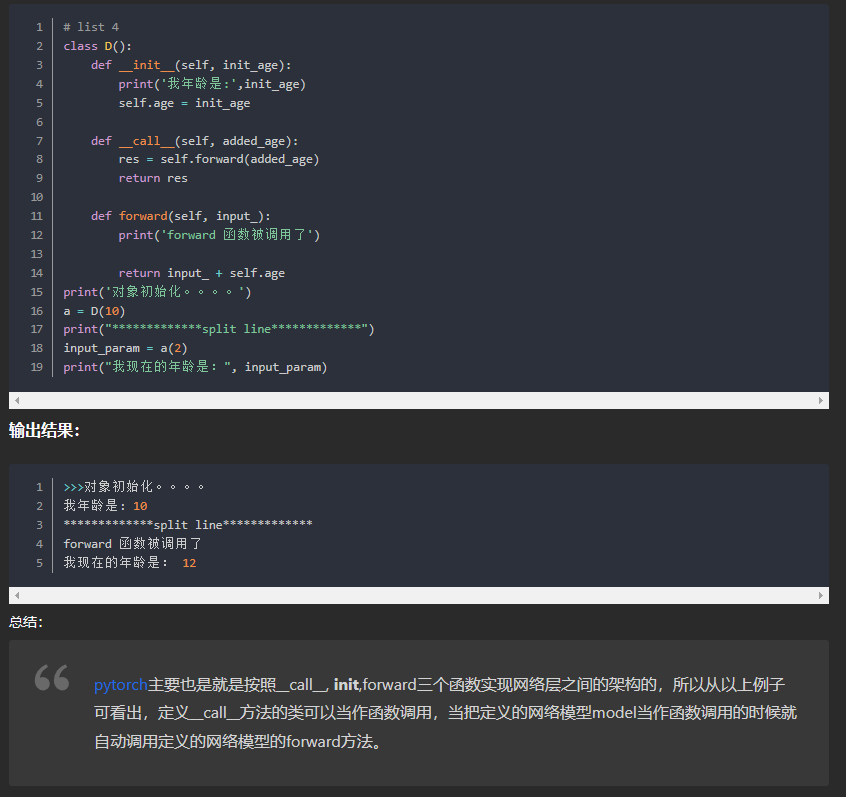

这部分总结如下：

> 1. forward是在```__call__```中调用的，而```__call__```函数是在类的对象使用'()'时被调用（如：`a()`）。一般调用在类中定义的函数的方法是：```a.func()```，如果只是使用```a()```，那么这个操作就是在调用```__call__```这个内置方法。
> 2. 神经网络例中，`out = net(image)`实际上就是调用了`net`的`__call__方法`，`net`的`__call__方法`没有显式定义，那么就使用它的__父类方法__，也就是调用`nn.Module`的`__call__方法`，它调用了`forward方法`，又有，`net类`中定义了`forward方法`，所以使用重写的`forward方法`。

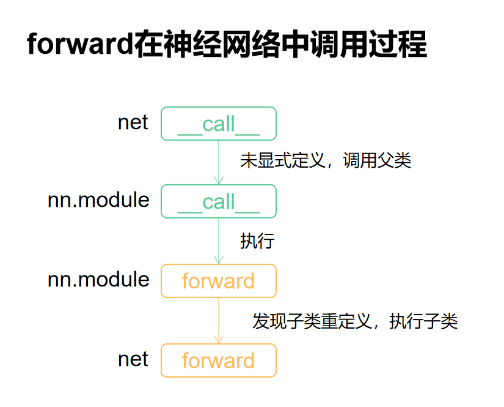

剩下关于forward调用的细节参见以下链接：[在PyTorch中，forward()是如何被调用的？](https://aitechtogether.com/article/32247.html)

## Encoder

Encoder部分为transformers结构左侧的部分，其中内部分为N个EncoderLayer，每个EncoderLayer由两个sublayer组成：Multi-Head Attention和simple, position-wise fully connected feed-forward network，每一个sublayer外由sublayerConnection包装。Encoder的代码框架如下所示：

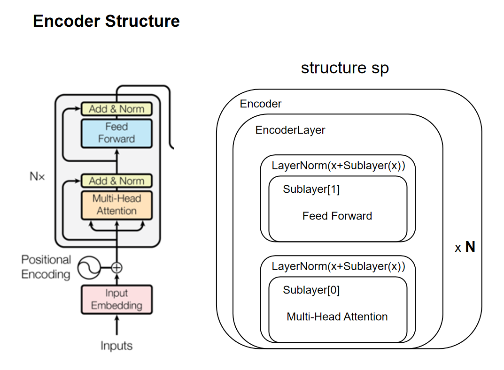

Encoder class所作的工作是深度拷贝N个EncoderLayer，并在x遍历完所有EncoderLayer后再进行一次LayerNorm。LayerNorm总共发生次数为`2N+1`次。

```python
def clones(module, N):
    "Produce N identical layers."
    return nn.ModuleList([copy.deepcopy(module) for _ in range(N)])
```

```python
class Encoder(nn.Module):
    "Core encoder is a stack of N layers"

    def __init__(self, layer, N):
        super(Encoder, self).__init__()
        self.layers = clones(layer, N)
        self.norm = LayerNorm(layer.size)

    def forward(self, x, mask):
        "Pass the input (and mask) through each layer in turn."
        for layer in self.layers:
            x = layer(x, mask)
        return self.norm(x)
```

clone function 深度拷贝module至N个作为Encoder的layers成员，将input x依次输入进每一个layer中。

> *这里使用了nn.ModuleList，ModuleList就像一个普通的Python的List，我们可以使用下标来访问它，它的好处是传入的ModuleList的所有Module都会注册的PyTorch里，这样Optimizer就能找到这里面的参数，从而能够用梯度下降更新这些参数。但是nn.ModuleList并不是Module(的子类)，因此它没有forward等方法，我们通常把它放到某个Module里。*

对最终的x进行LayerNorm处理，Layer Normalization通常用于 RNN 结构， 会将每一层神经元的输入都转成均值方差都一样的，这样可以加快收敛。

#### LayerNorm

```python
class LayerNorm(nn.Module):
    "Construct a layernorm module."
    
def __init__(self, features, eps=1e-6):
    super(LayerNorm, self).__init__()
    self.a_2 = nn.Parameter(torch.ones(features))
    self.b_2 = nn.Parameter(torch.zeros(features))
    self.eps = eps

def forward(self, x):
    mean = x.mean(-1, keepdim=True)
    std = x.std(-1, keepdim=True)
    return self.a_2 * (x - mean) / (std + self.eps) + self.b_2
```

- [ ] LayerNorm Paper reading

LN的公式如下：
$$
\textbf{h}=f(\frac{\textbf{g}}{\sqrt{\sigma^2+\varepsilon}}⊙(\textbf{x}-\mu)+\textbf{b})
$$
其中g即`self.a_2`，为增益(gain)，b即`self.b_2`，为偏置(bias)，用来保证归一化操作不会破坏以前的信息。其中eps为很小的小数，防止除0。外层f为激活函数。

#### EncoderLayer

如上所述，EncoderLayer由两个sublayer构成：Multi-Head Attention和fully connected feed-forward network。

```python
class EncoderLayer(nn.Module):
    "Encoder is made up of self-attn and feed forward (defined below)"

    def __init__(self, size, self_attn, feed_forward, dropout):
        super(EncoderLayer, self).__init__()
        self.self_attn = self_attn
        self.feed_forward = feed_forward
        self.sublayer = clones(SublayerConnection(size, dropout), 2)
        self.size = size

    def forward(self, x, mask):
        "Follow Figure 1 (left) for connections."
        x = self.sublayer[0](x, lambda x: self.self_attn(x, x, x, mask))
        return self.sublayer[1](x, self.feed_forward)
```

sublayer重用clone function来构建，其中sublayer[0]为Multi-Head Attention，sublayer[1]为fully connected feed-forward network。sublayer[0]和sublayer[1]之前存在数据的先后关系，故在EncoderLayer的forward function中先进行Multi-Head Attention再将处理结果提交至fully connected feed-forward network中最终作为整个结构的output。sublayer[0]有两个参数，第一个为tensor，第二个为callable，即SublayerConnection的第二个参数sublayer，该sublayer为callable，这里使用lambda隐藏了形参为x的一个函数命名，该函数以x为参数（mask为常量），调用self_attn函数。该形参x与第一个参数tensor x不是同一个x。

在encoder的structure sp中sublayer由sublayerConnection和sublayer具体实现两部分组成，其中sublayerConnection即为sp中的**LayerNorm(*x*+Sublayer(*x*))**，实现的是进行LayerNorm处理后的残差连接，残差连接通常用于解决多层网络训练的问题，可以让网络只关注当前差异的部分。

#### SublayerConnection

```python
class SublayerConnection(nn.Module):
    """
    A residual connection followed by a layer norm.
    Note for code simplicity the norm is first as opposed to last.
    """

    def __init__(self, size, dropout):
        super(SublayerConnection, self).__init__()
        self.norm = LayerNorm(size)
        self.dropout = nn.Dropout(dropout)

    def forward(self, x, sublayer):
        "Apply residual connection to any sublayer with the same size."
        return x + self.dropout(sublayer(self.norm(x)))
```

其中dropout机制作用为：**在训练过程的前向传播中，让每个神经元以一定概率p处于不激活的状态。以达到减少过拟合的效果**。是一种有助于训练的trick。

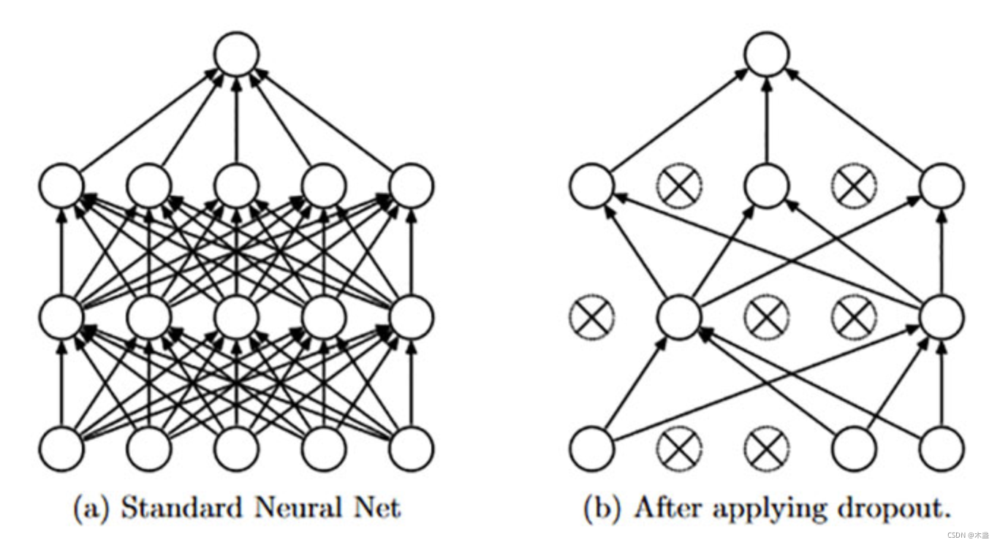

Multi-Head Attention和fully connected feed-forward network两个sublayer会在Decoder structure之后补充。

## Decoder

Decoder即结构中的右边部分，sp与encoder类似，DecoderLayer由三部分组成：与Encoder相同的两个sublayer和另外一个Masked Multi-Head Attention sublayer，其中EncoderLayer的结果作为memory存放在内存中，作为EncoderLayer的Multi-Head Attention的input参数。

```python
class Decoder(nn.Module):
    "Generic N layer decoder with masking."

    def __init__(self, layer, N):
        super(Decoder, self).__init__()
        self.layers = clones(layer, N)
        self.norm = LayerNorm(layer.size)

    def forward(self, x, memory, src_mask, tgt_mask):
        for layer in self.layers:
            x = layer(x, memory, src_mask, tgt_mask)
        return self.norm(x)
```

Decoder结构和Encoder并无太大差异，仅仅是输入参数的不同。

#### DecoderLayer

```python
class DecoderLayer(nn.Module):
    "Decoder is made of self-attn, src-attn, and feed forward (defined below)"

    def __init__(self, size, self_attn, src_attn, feed_forward, dropout):
        super(DecoderLayer, self).__init__()
        self.size = size
        self.self_attn = self_attn
        self.src_attn = src_attn
        self.feed_forward = feed_forward
        self.sublayer = clones(SublayerConnection(size, dropout), 3)

    def forward(self, x, memory, src_mask, tgt_mask):
        "Follow Figure 1 (right) for connections."
        m = memory
        x = self.sublayer[0](x, lambda x: self.self_attn(x, x, x, tgt_mask))
        x = self.sublayer[1](x, lambda x: self.src_attn(x, m, m, src_mask))
        return self.sublayer[2](x, self.feed_forward)
```

添加mask有效保证了预测位置i时只依据位置i前面的信息而不提前预知后面位置的信息。如图所示，每一行代表当前mask，例如对于位置0，mask[0]只有自身信息有用，而越到后面可知信息越多，以此形成正三角的形状。

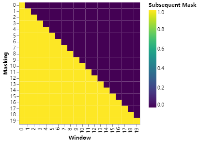

```python
def subsequent_mask(size):
    "Mask out subsequent positions."
    attn_shape = (1, size, size)
    subsequent_mask = torch.triu(torch.ones(attn_shape), diagonal=1).type(
        torch.uint8
    )
    return subsequent_mask == 0
```

triu function 返回上三角矩阵，再通过`subsequent_mask == 0`进行01反转，得到mask矩阵。

```
0 1 1 1 1                                       1 0 0 0 0
0 0 1 1 1                                       1 1 0 0 0
0 0 0 1 1    ->    subsequent_mask == 0  ->     1 1 1 0 0
0 0 0 0 1                                       1 1 1 1 0
0 0 0 0 0                                       1 1 1 1 1
```

mask的构建还有其他方式，参考GPT note中的colab course，例如先将future position设为-inf再通过softmax归一化形成mask矩阵。mask仅作为自回归属性的实现，在cross-attention（即layer[1]）那里便不需要加mask，因为此时需要KV也就是目标语言表示的所有信息。

偏移（offset）机制是为自回归提供ground_truth，也就是从起始符<\s>开始自回归预测。举例来说便是通过右移(shifted right)将给定squenece“I like bananas”变成“<\s> I like”。

## Attention

transformers所用的attention为"Scaled Dot-Product Attention"，是得分函数之一（除此之外还有additive/concat等）其过程如下：

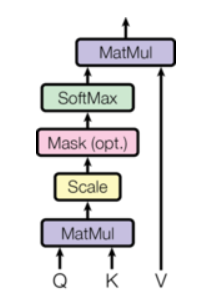

Q stands for "a set of queries" while K stands for "a set of keys". 两者均为向量组成的矩阵，用来反映X之间各元素的相关性，<u>key即键向量，作为某一input即单词的表示，query即查询向量，作为当前被编码词的表示。</u>该相关性最后经过softmax归一化后通过与矩阵V相乘来将该相关性反映到X当中。过程的公式和代码如下：

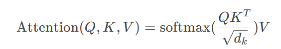

```python
def attention(query, key, value, mask=None, dropout=None):
    "Compute 'Scaled Dot Product Attention'"
    d_k = query.size(-1) #size -1 stands for the last dimension
    scores = torch.matmul(query, key.transpose(-2, -1)) / math.sqrt(d_k)
    # key.transpose(-2, -1)即转置key的倒数第一个维度和倒数第二个维度
    # eg: Q(30, 8, 33, 64) means batch:30, head:8, squence_length:33, feature_n:64
    # 该matmul只计算query和key的最后两维的矩阵相乘
    # eg: After matmul: scores(30, 8, 33, 33)
    if mask is not None:
        scores = scores.masked_fill(mask == 0, -1e9) # mask broadcasting
        # 将mask中0对应scores位置的值替换为很小的小数-1e9，理论上用了点未来的信息
        # eg: mask(30, 1, 1, 33)，利用broadcasting，第二维为1即多头用的是一个mask，第三维为1，同样采用broadcasting，因为src-atten每一时刻都能够观测到其他时刻（相对于self_mask要按时刻不同构造不同时刻的mask，此时mask维度为(30, 1, 33, 33)，形为下三角矩阵），故可以通过broadcasting来完成
    p_attn = scores.softmax(dim=-1)
    if dropout is not None:
        p_attn = dropout(p_attn)
    return torch.matmul(p_attn, value), p_attn
```

##### Mask 维度补充 （参考blog 7，原文有误）

```python
in DecoderLayer class:
    ...
	x = self.sublayer[0](x, lambda x: self.self_attn(x, x, x, tgt_mask))
	x = self.sublayer[1](x, lambda x: self.src_attn(x, m, m, src_mask))
    ...
```

使用简单的例子，batch取2，head取1，第一个序列长度为3，第二个序列长度为4，则src-attn的src_mask维度为(2,1,1,4)，表示为

```
batch[0]: [1, 1, 1, 0] # 第四个时刻为padding，故填0（序列长度为3，没有第四个时刻）
batch[1]: [1, 1, 1, 1]
```

就batch[0]而言，无论是序列中的哪一时刻，其mask都是[1, 1, 1, 0]，第一时刻也可以attend to后面两个时刻；而对于self_attn的tgt_mask，因为要满足auto_regressive特性，t时刻只能获得[0 ~ t-1]时刻的信息，故该mask使用subsequent_mask function来定义，即下三角矩阵，表示为

```
第一个序列的mask矩阵
1 0 0 0
1 1 0 0
1 1 1 0
1 1 1 0

第二个序列的mask矩阵
1 0 0 0
1 1 0 0 
1 1 1 0
1 1 1 1
```

之所以要标准化进行`/ math.sqrt(d_k)`操作，是因为防止出现有的参数权重太大导致影响力过大，导致模型不稳定，稍微一动就会有大的变化；有些参数权重太小导致怎么改变都对最终结果影响甚微。

QKV三者均是关于input X的线性组合，即

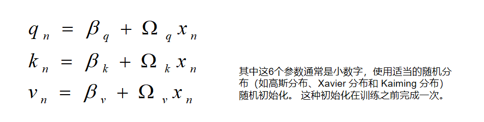

#### Attention过程详解

由于dot-product可以转化为矩阵计算来加速，Attention内部的计算顺序变得不可见了，而虽然矩阵能够化简计算，但影响了阅读者对attention机制的理解。Attention虽然在公式上已化约为三个矩阵的计算，但顺序和每一步的意义并不如计算表面那样。


Attention的过程可以如上动态图表示，其中每一个input x对应着一个query、key和value，三者都是关于input x的一种表示，该表示的维度自定（图例中的维度为3），作为QKV矩阵的第二维度；QKV矩阵的第一维度为input的维度，**意味着对于input x内每一个元素，都有3个参数来反映**。

> **Notes**
>
> *The dimension of* **query** *and* **key** *must always be the same because of the dot product score function. However, the dimension of* **value** *may be different from* **query** *and* **key**. *The resulting output will consequently follow the dimension of* **value**.
>
> qk的维度必须相同，而value可以不同，因为qk是通过点积计算的，计算出来永远是一个标量，而value是分别与标量相乘，所以其维度只反映在最终结果上，而不影响中间的计算。

##### Step1 qkv计算

如前所述，每一个input x对应着一个query、key和value，生成这三个指标的参数都是随机生成的，所以除了命名不同，它们本质上都是一样的。qkv计算的公式如上。

##### Step2 query*key得分

此处的score function为dot-product，即将某一个input的query和所有input的key点乘分别得到3个值，该值（或scaled后）反映得分情况，即图示蓝色块。

##### Step3 相乘累加得到sum

计算出score后将该值与value相乘，这一步一共发生3次，将这3个值最终相加在一起，得到的结果便是这一个query所得到的得分结果，即该input的注意力值。

综上即可知query意为查询，每一个input对其他input进行相关度查询（一个input即一个单词），key作为元素的键能够与query点乘来满足查询需要，最后将得分与每个input的value相乘累加。

#### Multi-Head Attention

多头注意力机制使用多组QKV，可以理解为每一组QKV表示词与词之间的联系，多组即拥有了多种联系的表示能力，其1）扩展了模型专注于不同位置的能力，2）为注意力层提供了多个“表示子空间”（如中间图所示，）。右侧图即多头注意力机制，其中参数h即head的个数，也就是切割程度。

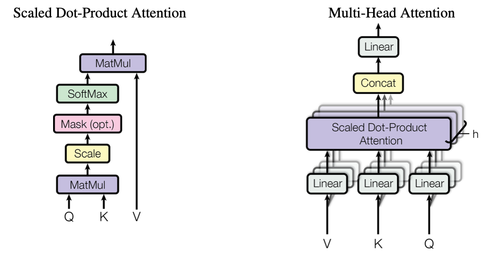

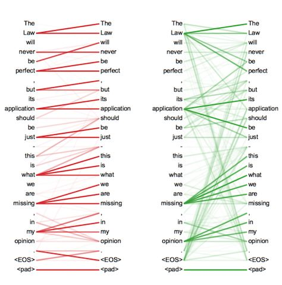

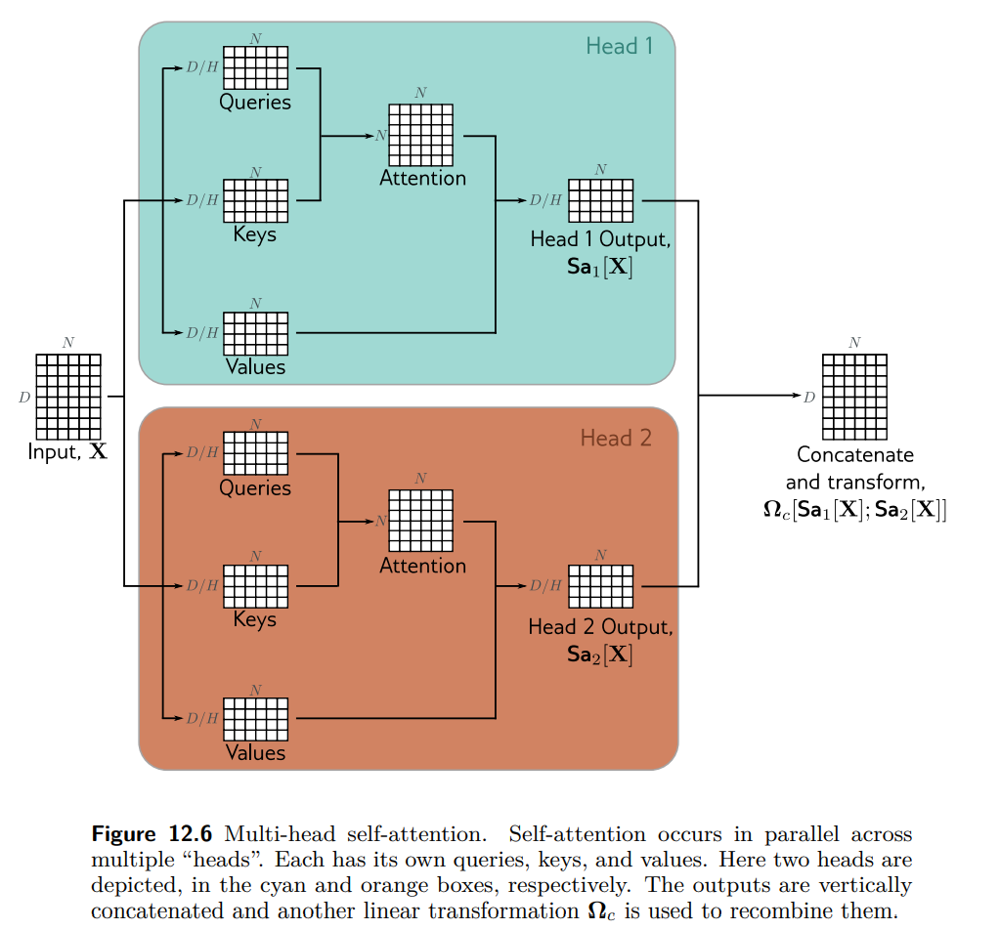

可以看出多头切割的是input x的维度，也就是x中的元素分多组小的QKV组合去处理。多头注意力机制代码如下：

```python
class MultiHeadedAttention(nn.Module):
    def __init__(self, h, d_model, dropout=0.1):
        "Take in model size and number of heads."
        super(MultiHeadedAttention, self).__init__()
        assert d_model % h == 0
        # We assume d_v always equals d_k
        # d_model即input x的维度
        self.d_k = d_model // h
        self.h = h
        self.linears = clones(nn.Linear(d_model, d_model), 4)
        #linears重用clone，生成4个512x512的全连接参数矩阵，用于以下两处AB
        self.attn = None
        self.dropout = nn.Dropout(p=dropout)

    def forward(self, query, key, value, mask=None):
        "Implements Figure 2"
        if mask is not None:
            # Same mask applied to all h heads.
            mask = mask.unsqueeze(1)
            # 由于分了multi-head，所以mask的维度增加一维，变成(batch, 1, 1, time)
        nbatches = query.size(0)
        # batch的大小即query的第一维

        # 1) Do all the linear projections in batch from d_model => h x d_k
        query, key, value = [
            lin(x).view(nbatches, -1, self.h, self.d_k).transpose(1, 2)
            for lin, x in zip(self.linears, (query, key, value))
            # A 使用前三个linears[0-2]，辅助QKV矩阵的映射，进行对QKV的变换
        ]

        # 2) Apply attention on all the projected vectors in batch.
        x, self.attn = attention(
            query, key, value, mask=mask, dropout=self.dropout
        )

        # 3) "Concat" using a view and apply a final linear.
        x = (
            x.transpose(1, 2)
            .contiguous()
            .view(nbatches, -1, self.h * self.d_k)
        )
        # 再将x变换为原来的格式，反向的过程
        del query
        del key
        del value
        return self.linears[-1](x) # B 使用最后一个矩阵，对x进行一次变换
```

> *zip(self.linears, (query, key, value))是把(self.linears[0],self.linears[1],self.linears[2])和(query, key, value)放到一起然后遍历。我们只看一个self.linears[0] (query)。根据构造函数的定义，self.linears[0]是一个(512, 512)的矩阵，而query是(batch, time, 512)，相乘之后得到的新query还是512(d_model)维的向量，然后用view把它变成(batch, time, 8, 64)。然后transponse成(batch, 8,time,64)，这是attention函数要求的shape。分别对应8个Head，每个Head的Query都是64维。*
>
> *x.transpose(1, 2)把x变成(batch, time, 8, 64)，然后把它view成(batch, time, 512)，其实就是把最后8个64维的向量拼接成512的向量。最后使用self.linears[-1]对x进行线性变换，self.linears[-1]是(512, 512)的，因此最终的输出还是(batch, time, 512)。我们最初构造了4个(512, 512)的矩阵，前3个用于对query，key和value进行变换，而最后一个对8个head拼接后的向量再做一次变换。*

由transformers结构图可以看到，多头注意力机制在三处有使用，分别是encoder的layer[0]和decoder的layer[0]和layer[1]，其中encoder的layer[0]的QKV来自同一地方，decoder的layer[0]同样如此，不过添加了mask机制来保留自回归性质；decoder的layer[1]也即“encoder-decoder attention” layers，Q来自于decoder的layer[0]，而memory KV来自encoder的输出。

## Position-wise Feed-Forward Networks

Position-wise Feed-Forward Networks，即基于位置的前馈网络。

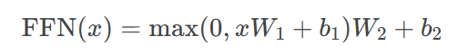

除了设置两组不同参数的layer，另一种方式是将其作为两个内核大小为1的卷积（或者认为是两次线性变换，如代码中所示）来处理。The dimensionality of input and output is *d_model=512*, and the inner-layer has dimensionality *d_ff=2048*.

```python
class PositionwiseFeedForward(nn.Module):
    "Implements FFN equation."

    def __init__(self, d_model, d_ff, dropout=0.1):
        super(PositionwiseFeedForward, self).__init__()
        self.w_1 = nn.Linear(d_model, d_ff)
        self.w_2 = nn.Linear(d_ff, d_model)
        self.dropout = nn.Dropout(dropout)

    def forward(self, x):
        return self.w_2(self.dropout(self.w_1(x).relu()))
```

## Embeddings and Softmax

Similarly to other sequence transduction models, we use learned embeddings to convert the input tokens and output tokens to vectors of dimension *d_model*. 

```python
class Embeddings(nn.Module):
    def __init__(self, d_model, vocab):
        super(Embeddings, self).__init__()
        self.lut = nn.Embedding(vocab, d_model)
        # nn.Embedding(vocab, d_model)含义是生成vocab个d_model维度的词汇表
        self.d_model = d_model

    def forward(self, x):
        return self.lut(x) * math.sqrt(self.d_model)
```

one-hot vector相当于从词汇表中将给定文本中的这些词提取出来组成新的inputX的过程。

nn.Embedding(vocab, d_model)含义是生成vocab个d_model维度的词汇表，如下图所示：

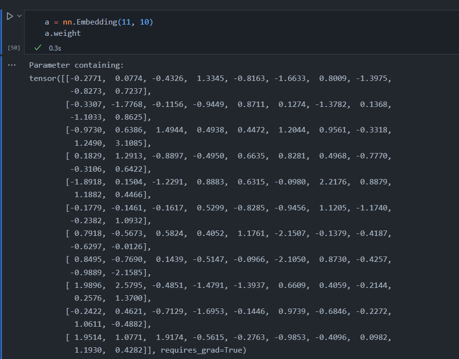

## Positional Encoding


```python
class PositionalEncoding(nn.Module):
    "Implement the PE function."

    def __init__(self, d_model, dropout, max_len=5000):
        super(PositionalEncoding, self).__init__()
        self.dropout = nn.Dropout(p=dropout)

        # Compute the positional encodings once in log space.
        pe = torch.zeros(max_len, d_model) # ([max_len, d_model])
        position = torch.arange(0, max_len).unsqueeze(1)  # ([max_len, 1])
        div_term = torch.exp(
            torch.arange(0, d_model, 2) * -(math.log(10000.0) / d_model)
        ) # ([d_model/2])
        # (position * div_term).shape : ([max_len, d_model/2])
        pe[:, 0::2] = torch.sin(position * div_term) # 从0开始每隔两列，即偶数列
        pe[:, 1::2] = torch.cos(position * div_term) # 从1开始，即奇数列
        pe = pe.unsqueeze(0) # ([1, max_len, d_model])
        self.register_buffer("pe", pe)

    def forward(self, x):
        # self.pe[:, : x.size(1)] shape: ([1, x.size(1), 24])
        # 第一维利用广播，最后一维d_model不变，只改变中间squence_length的实际长度
        x = x + self.pe[:, : x.size(1)].requires_grad_(False)
        return self.dropout(x)
```

函数型位置编码公式如下：

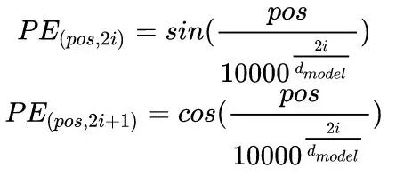

> 一种好的位置编码方案需要满足以下几条要求：
>
> - 它能为每个时间步输出一个独一无二的编码；
>
> - 不同长度的句子之间，任何两个时间步之间的距离应该保持一致；
> - 模型应该能毫不费力地泛化到更长的句子。它的值应该是有界的；
> - 它必须是确定性的。

使用函数型位置编码能够得知相对位置，如下图所示：

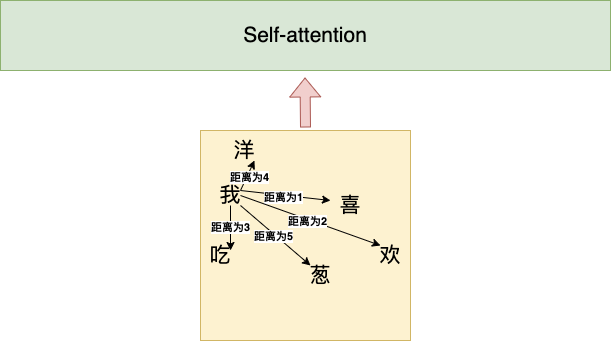

使用sin cos函数便来表示便可以得出相对位置信息，结论是两个token距离越远位置量PE的乘积结果越小。使用该方式的缺点在于只知道距离信息而没有方向信息，谁在前谁在后是无从得知的，如下公式所示。

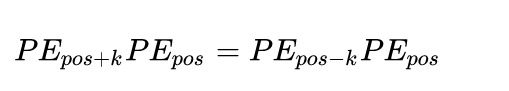

#### Other QAs

1. `x = x + self.pe[:, : x.size(1)].requires_grad_(False)`使用加法来将位置信息添加进input x中是因为位置信息在很大的embedding dimension中只占了很小一部分，这一小部分也很容易被transformers分离出来。
2. 位置信息之所以不因为进入更高层而损失是通过残余连接来保证的，残余连接也是为了当model变得deeper后loss accuracy达到饱和，通过添加该机制能够更好的进行训练。
2. positional encoding还有其他方式，如直接调用transformer.wpe

```python
from transformers import GPT2LMHeadModel

model = GPT2LMHeadModel.from_pretrained('gpt2')  # or any other checkpoint
word_embeddings = model.transformer.wte.weight  # Word Token Embeddings 
position_embeddings = model.transformer.wpe.weight  # Word Position Embeddings 
```

4. 在GPT中，作者对position embedding矩阵进行随机初始化，并让模型自己学习，而不是采用正弦余弦函数进行计算。

## Full Model

make_model function implementation

```python
def make_model(
    src_vocab, tgt_vocab, N=6, d_model=512, d_ff=2048, h=8, dropout=0.1
):
    "Helper: Construct a model from hyperparameters."
    c = copy.deepcopy
    attn = MultiHeadedAttention(h, d_model)
    ff = PositionwiseFeedForward(d_model, d_ff, dropout)
    position = PositionalEncoding(d_model, dropout)
    model = EncoderDecoder(
        Encoder(EncoderLayer(d_model, c(attn), c(ff), dropout), N),
        Decoder(DecoderLayer(d_model, c(attn), c(attn), c(ff), dropout), N),
        nn.Sequential(Embeddings(d_model, src_vocab), c(position)),
        nn.Sequential(Embeddings(d_model, tgt_vocab), c(position)),
        Generator(d_model, tgt_vocab),
    )

    # This was important from their code.
    # Initialize parameters with Glorot / fan_avg.
    for p in model.parameters():
        if p.dim() > 1:
            nn.init.xavier_uniform_(p)
    return model
```

整个encoder-decoder运行过程如下所示：


##### Step1 编码器将input生成注意力向量集

第一部分是编码器，将input单词进行词嵌入和位置编码后生成的向量输入进encoder结构中，encoder结构通过两层sublayers——multi-head attention和feed-forward为主的sublayer——处理后输出词的表示（即Key键向量）和词的价值（即Value值向量），组成注意力向量集。

##### Step2 由起始符</s>开始依据注意力向量集进行推测生成输出

得到注意力向量集后，即作为decoder的KV来使用，此时decoder的输入进行了整体右移（Shifted Right），第一个输入input为起始符</s>，通过起始符词嵌入和位置编码后进入decoder结构预测出output第一个单词。

##### Step3 将每次生成的output重新作为input传入decoder中进行对下一单词的预测

迭代decoder的过程，直到输出为终止符<end of sentence>，整个decoder过程结束。


### 后续

1. 对于transformers结构，近来并没有太多的变动，但有一处进行了变动，即将layerNorm从attention的后面提到了前面，也就是pre-norm formulation；
2. dropout加在linear的后面，也可以加在softmax的后面；

3. encoder做的是对目标语言的解码工作，decoder是自回归，基于相同的语言逐字生成和预测；
4. self-attention是decoder中的layer[0]，self即QKV都来自于input x，而layer[1]名为cross-attention，其KV均来自另一个output（encoder的output，即对应目标语言的编码表示），而Q来自于input x。

5. chatGPT的pre-training工作即对应给定文本，进行大量训练；fine-tuning的过程是chatGPT website上给的：

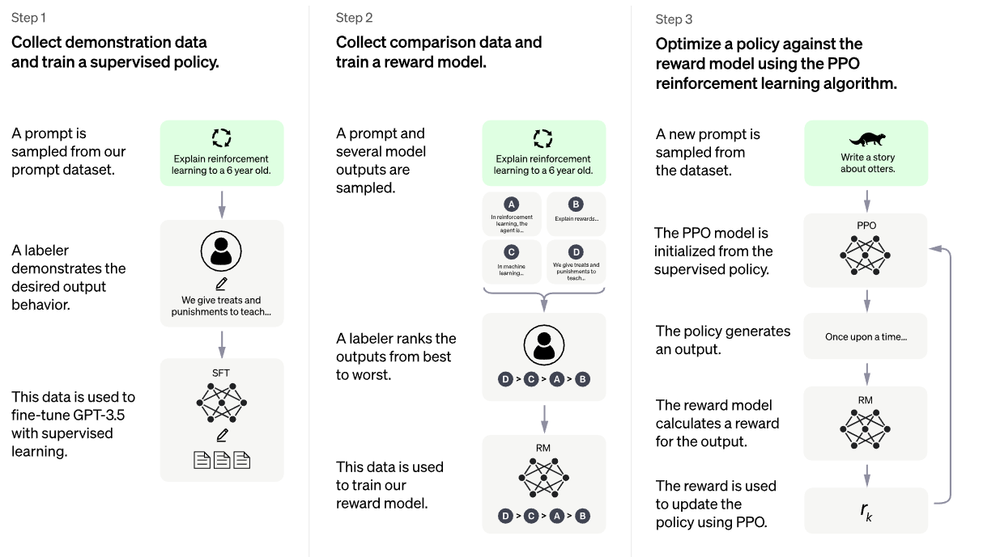

通过监督学习，强化学习等方式进行微调，微调将model的功能从document completer变成针对具体任务。
