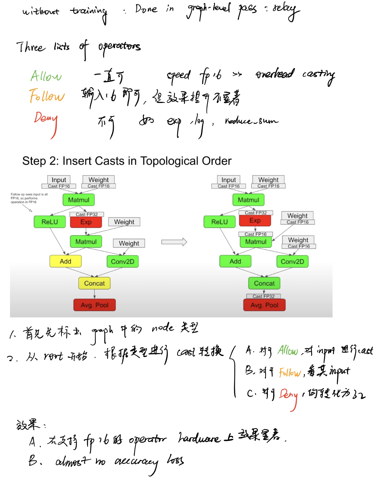

# fp32转fp16

tvm的fp32转fp16操作能极大提升性能，该type的转化是在relay ir的计算图层进行的，直接调用`tvm.relay.transform.ToMixedPrecision()(mod)`即可。

笔记整理自会议[How to Use FP16 Quantization in TVM - by OctoML @ TVMCon 2021 ](https://www.youtube.com/watch?v=D0k8T6AC1p8)

将openai-gpt转fp16后，信息整理至[gpt-frontend/infor16.txt](https://github.com/nineis7/gpt-frontend/blob/main/infor16.txt)，常见的操作和list表对应关系如下：

| ALWAYS_LIST     | FOLLOW_LIST  | NEVER_LIST    |
| --------------- | ------------ | ------------- |
| nn.dense        | broadcast_to | nn.softmax    |
| nn.batch_matmul | reshape      | nn.layer_norm |
|                 | split        |               |
|                 | ...          |               |

其中Follow_list较多，分为以下几类：

| FOLLOW_LIST 门下类                                           |                                          |
| ------------------------------------------------------------ | ---------------------------------------- |
| These ops add new data or change shape                       | split, transpose, broadcast_to...        |
| Comparison                                                   | less, greater, less_equal, greater_equal |
| By definition copy and cast will depend on inputs for output. | copy, cast, cast_like                    |
| Simple arithmetic                                            | add, multiply, nn.batch_norm, divide...  |
| Simple activations                                           | max, nn.relu, nn.dropout...              |
| Complicated activations which saturate in a narrow range     | sigmoid, fast_exp...                     |
| Pooling operations                                           | nn.max_pool1d, nn.adaptive_max_pool1d... |

`tvm.relay.transform.ToMixedPrecision()(mod)`转化后有一类操作未转化，为`broadcast_to`，为改变形状的FOLLOW_LIST门下第一类，手动在list中添加即可。