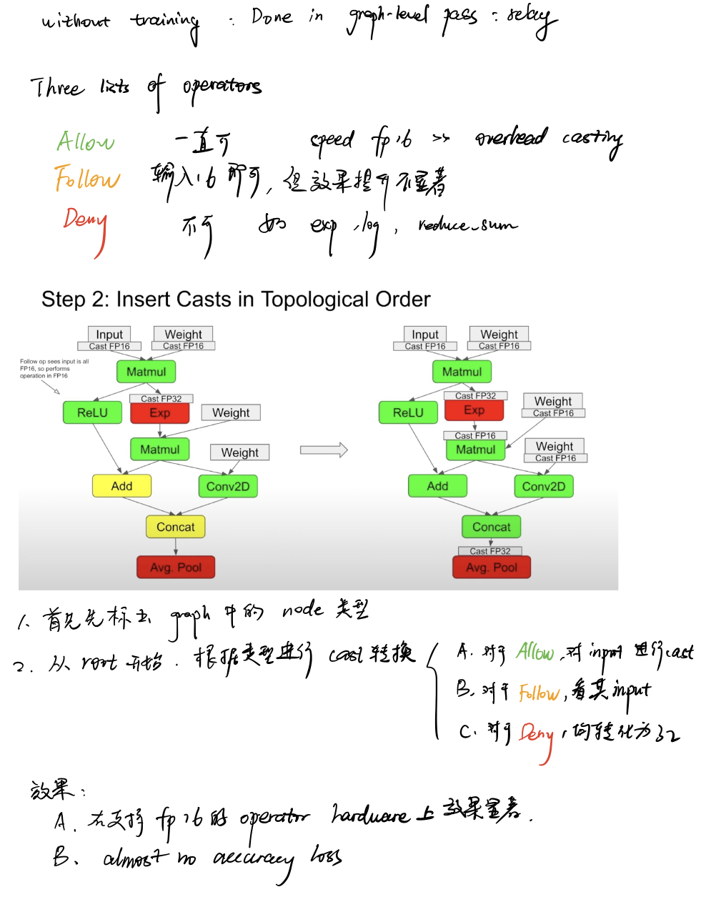

# fp32转fp16

tvm的fp32转fp16操作能极大提升性能，该type的转化是在relay ir的计算图层进行的，直接调用`tvm.relay.transform.ToMixedPrecision()(mod)`即可。

笔记整理自会议[How to Use FP16 Quantization in TVM - by OctoML @ TVMCon 2021 ](https://www.youtube.com/watch?v=D0k8T6AC1p8)

将openai-gpt转fp16后，信息整理至[gpt-frontend/infor16.txt](https://github.com/nineis7/gpt-frontend/blob/main/infor16.txt)，常见的操作和list表对应关系如下：

| ALWAYS_LIST     | FOLLOW_LIST  | NEVER_LIST    |
| --------------- | ------------ | ------------- |
| nn.dense        | broadcast_to | nn.softmax    |
| nn.batch_matmul | reshape      | nn.layer_norm |
|                 | split        |               |
|                 | ...          |               |

其中Follow_list较多，分为以下几类：

| FOLLOW_LIST 门下类                                           |                                          |
| ------------------------------------------------------------ | ---------------------------------------- |
| These ops add new data or change shape                       | split, transpose, broadcast_to...        |
| Comparison                                                   | less, greater, less_equal, greater_equal |
| By definition copy and cast will depend on inputs for output. | copy, cast, cast_like                    |
| Simple arithmetic                                            | add, multiply, nn.batch_norm, divide...  |
| Simple activations                                           | max, nn.relu, nn.dropout...              |
| Complicated activations which saturate in a narrow range     | sigmoid, fast_exp...                     |
| Pooling operations                                           | nn.max_pool1d, nn.adaptive_max_pool1d... |

`tvm.relay.transform.ToMixedPrecision()(mod)`转化后有一类操作未转化，为`broadcast_to`，为改变形状的FOLLOW_LIST门下第一类，手动在list中添加即可。

三个list下op的变换只需要将op放到对应的list下即可。

#### performance

直接使用预训练模型的benchmark为8.36s，转化为tvm realy ir后时间为15.28s，fp32转16后时间为15.85s。

| pre_train model | relay ir fp32 model | fp16 model |
| :-------------: | :-----------------: | :--------: |
|      8.36s      |       15.28s        |   15.85s   |

转化为tvm ir后时间翻倍，且ToMixedPrecision()转化后性能不增反减。对于性能损失现象，ToMixedPrecision()的编写者[AndrewZhaoLuo](https://discuss.tvm.apache.org/u/AndrewZhaoLuo)有如下回复：

> **Q:And after I use the TVM interface to reduce the model accuracy to int8, the inference speed is reduced by more than 50 times.is this normal?？ I am trying to locate this problem. Or later I will try to use the quantified model to optimize.**
>
> *A: There are a lot of variables here. In general if you are using the autoscheduler to schedule, you might see speed-downs since I believe it lacks support for using hardware intrinsics like vectorization with integers. It’s hard to add too which is why no one has done it yet. With autotvm, some operators support int8 quantization well (e.g. they use hardware intrinsics well) and others do not.*
>
> *In short, the answer is complicated and depends on the model and how you tuned/ran the model. 5x speed downs I have seen in the past due to gaps in integer support on the scheduling level. FP16 quantization is very good if you have hardware which supports it well (e.g. a new enough ARM (ISA v8.2+), a GPU, something opencl supports with FP16 intrinsics)*

