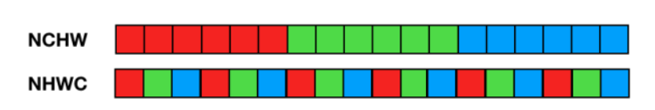

[toc]

# OPU compiler code


3-17
- [ ] opu-compiler tvm 自定义pass
- [ ] Conv-BN-ReLU算子融合
- [ ] TVM算子融合
- [ ] OPU算子融合
- [ ] 算子融合常见总结
- [ ] 一篇算符融合论文
- [x] OPU compiler paper
## compiler frontend pass

自定义pass之前tvm有不少pass squence，比较重要的是以下几个，其他的后续可以补充：

|   Pass name    |                 Content                  |
| :------------: | :--------------------------------------: |
|   Legalize()   | 等价转换，将某些算子转换为等价的relay op |
| FoldConstant() |                 常量折叠                 |
| PrintIR(false) |               输出relay ir               |
|   FuseOps()    |               tvm 算符融合               |
|      ...       |                                          |

其中FuseOps()将在FuseOpCustom()自定义算符融合处一并介绍。自定义Pass之前的realy ir见beforeCusPass.txt，自定义算符融合之前的ir见beforeCusFuseop.txt，之后的ir见afterCusFuseop.txt。

自定义Pass如下：

|             Pass name             |       Content        |
| :-------------------------------: | :------------------: |
|          ToNCHWLayout()           | 将NHWC格式转化为NCHW |
|            Peephole()             |   针对hw的一些优化   |
|      CanonicalizeConcatPos()      |                      |
|         FuseOpHWCustom()          |    自定义算符融合    |
| GenIR(quantize, use_post_padding) |     生成json文件     |
- ### to_nchw_layout
  
  
  
  NCHW格式与NHWC的区别如下：
  
  
  
  总的来说，NHWC格式访存局部性更好，而NCHW需要占用较大的临时空间，但NCHW更适合GPU，速度会更快，更适合拥有一定bandwidth的memory进行操作。【TODO暂时不知道为啥要转】
#### tvm遍历方式

tvm的relay ir采用称为访问者的设计模式，针对计算图的遍历，tvm设计出基类`ExprFunctor`，并且继承其设计两个针对不同使用场景的类：`ExprVisitor`和`ExprMutator`。`ExprVisitor`不用于修改程序的pass，而是用于实施程序分析和收集信息的pass。

`ExprVisitor`的code如下：

```c++
/*!
 * \brief A simple visitor wrapper around ExprFunctor.
 *  Recursively visit the content.
 *
 * ExprVisitor treats Expr as dataflow graph,
 * and only visit each Expr node once.
 */
class ExprVisitor
  : public ::tvm::relay::ExprFunctor<void(const Expr& n)> {
 public:
void VisitExpr(const Expr& expr) override;
void VisitExpr_(const VarNode* op) override;
void VisitExpr_(const GlobalVarNode* op) override;
void VisitExpr_(const ConstantNode* op) override;
void VisitExpr_(const TupleNode* op) override;
void VisitExpr_(const FunctionNode* op) override;
void VisitExpr_(const CallNode* op) override;
void VisitExpr_(const LetNode* op) override;
void VisitExpr_(const IfNode* op) override;
void VisitExpr_(const OpNode* op) override;
void VisitExpr_(const TupleGetItemNode* op) override;
void VisitExpr_(const RefCreateNode* op) override;
void VisitExpr_(const RefReadNode* op) override;
void VisitExpr_(const RefWriteNode* op) override;
void VisitExpr_(const ConstructorNode* op) override;
void VisitExpr_(const MatchNode* op) override;
virtual void VisitType(const Type& t);
virtual void VisitClause(const Clause& c);
virtual void VisitPattern(const Pattern& c);

 protected:
// Internal visiting counter
std::unordered_map<const Object*, size_t> visit_counter_;
};
```

`VisitExpr`函数是在`VisitExpr_`上层的top-level traverse，其使用相比于`VisitExpr_`针对具体node类型的具体操作，无需知道每个结点的具体类型，只需传入`Expr`类型的参数即可进行graph的遍历。
-