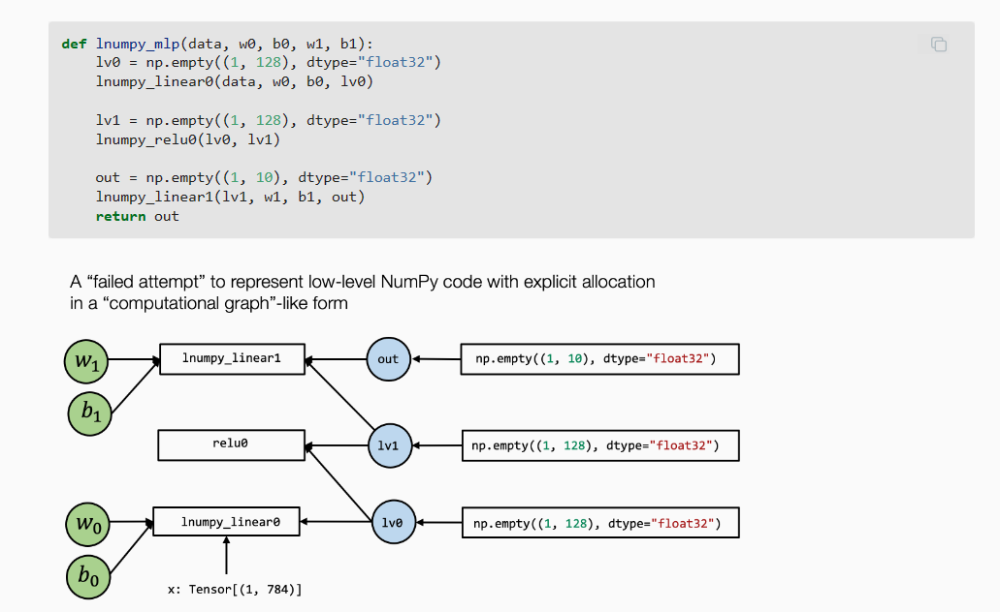
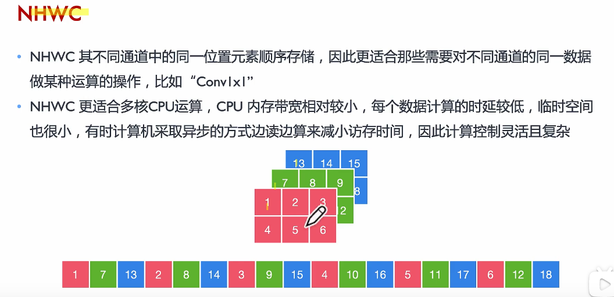
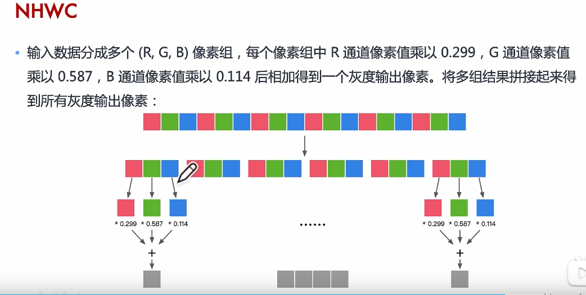

- [ ] Conv-BN-ReLU算子融合
- [ ] TVM算子融合
- [ ] OPU算子融合
- [ ] 算子融合常见总结

# MLC

---

mlc指将算法从开发形态变成部署形态

mlc goal：

- 整合与最小化依赖
- 利用硬件自身自带的加速特性
- 优化


mlc关键元素：Tensor and TensorFunction，mlc所做的便是张量函数之间的组合变换（with different abstractions），张量函数可以是单一算子，也可以是多算子的融合，更可以是端到端的整个过程；抽象与实现，抽象指定做什么，实现指定怎么做。

call_tir(prim_func, inputs, shape, dtype) ，引入call_tir是因为元张量函数(即prim_func)本身具有destination passing的约定，而out的数组的开辟便由call_tir来完成。这是一个底层转高层的过程，将底层函数用标准计算图的形式来表示出来，如下图所示：



下图不适用call_tir时计算图的表示比较混乱，出现了显式lv0等中间结果节点，即出现了side-effect。

具体来说，计算图通常具有以下性质：

- 框的每个输入边对应于操作的输入；
- 每个出边对应于操作的输出；
- 每个操作可以任意重新排序，直到边缘的拓扑顺序。

使用call_tir代码如下：

```python
lv0 = R.call_tir(linear0, (x, w0, b0), (1, 128), dtype="float32")

def lnumpy_call_tir(prim_func, inputs, shape, dtype):
    # A.开辟内存空间
    # B.遵循destination passing传统
    res = np.empty(shape, dtype=dtype)
    prim_func(*inputs, res)
    return res
```

使用dataflow来标注可以成为计算图并进行优化的部分

之所以要对{参数，中间节点，输出节点}做节点类别区分，是因为优化时可能会对中间节点进行消除（例如linear和relu合并成linear_relu之后linear向relu传的中间节点便被消除），而输出的结果节点可能会被其他计算图所调用，存在依赖关系，要进行全局分析。

`w_torch = torch.from_dlpack(x)`其中x type为tvm.nd.NDArray，x_torch为torchTensor，而x和x_torch共享内存，相当于不重新生成内存的情况下进行了两个类型对一片空间的指向。

将参数绑定为附加到 IRModule 的常量通常会降低API的复杂程度

```python
MyModuleWithParams = relax.transform.BindParams("main", nd_params)(MyModuleMixture)

def main(x: Tensor((1, 784), "float32")) -> Tensor(None, "float32", ndim = 2):
        # block 0
        with R.dataflow():
            lv0 = R.call_tir(linear0, (x, meta[relay.Constant][0], meta[relay.Constant][1]), (1, 128), dtype="float32")
            lv1 = R.call_tir("env.relu", (lv0,), (1, 128), dtype="float32")
            out = R.call_tir("env.linear", (lv1, meta[relay.Constant][2], meta[relay.Constant][3]), (1, 10), dtype="float32")
            R.output(out)
        return out
```

其中meta为dictionary，为模组中的元数据，w0,w1等参数就被转化为了`meta[relay.Constant][0]`，`meta[relay.Constant][1]`，由此可以达到减少参数的个数的目的。

trace记录了之前所作的所有变换操作

程序变换方式之一：随机变换，通过loop来将搜索空间内可能全部算出结果，求出最优解；

# AI编译器原理

---

AI编译器相较传统编译器更highlevel一点，是建基于传统编译器之上的，针对计算图的优化。

AI编译器通常会降低计算精度，因为深度学习对计算精度不那么敏感。

Frontend前端优化

- 节点级优化，如：Zero-dim-tensor elimination， Nop Elimination
- 块级优化，如代数简化、常量折叠、算子融合
- 数据流级优化，如CSE、DCE


一个变量的内存地址如果正好等于它的长度的整数倍，则称为自然对齐。

NCHW：通道优先，更适合需要对每个通道单独运算的操作，如MaxPooling，计算时需要的存储更多，适合GPU

NHWC：不同通道中同一位置优先顺序存储，更适合那些对不同通道同一位置的数据进行运算的操作，如Conv1x1，更适合多核CPU运算





相比于NCHW将所有数据读取完后一次性计算，NHWC每次计算出最终结果的一部分。