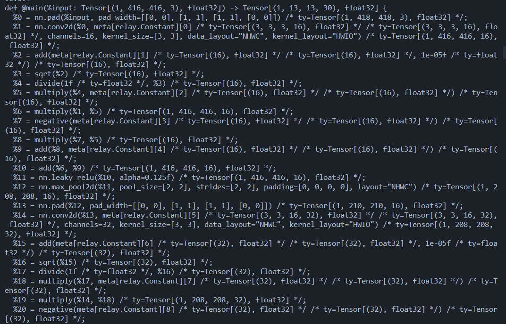
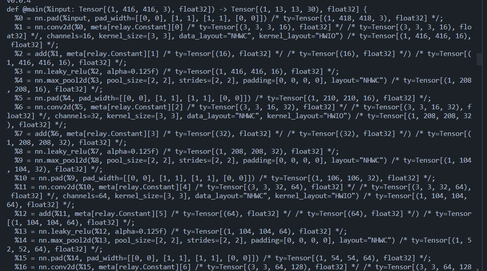
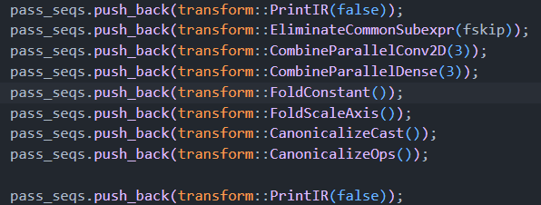

# 侯捷C++ partII

## conversion function
## non-explicit-one-argument ctor
上述两种技术用于类型转换

# tvm回顾

group思想类似于compiler graph中的控制流图或依赖关系图

进行常量折叠和消除公共子序列等操作后的区别如上，简而言之便是将BatchNormalization层的计算提前做完，直接得到计算值，省去了七八步的具体计算步骤。