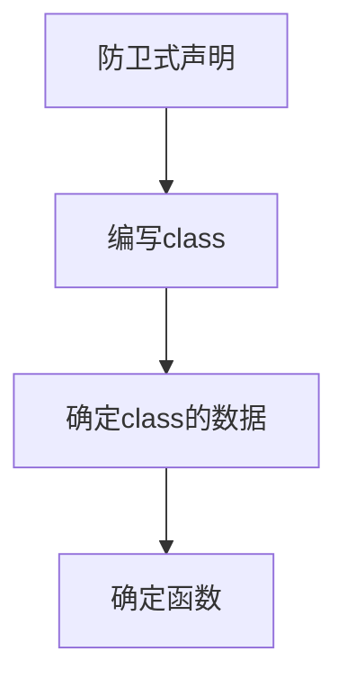

# 复习总结已学
*2022 October edition*

非成员函数的重载
```c++
/* 注意事项：
 *  1.return by value，因为返回的是一个local object；
 *  2.传参为传引用，速度快；
 *  3.return后面的写法为typename(),即complex(args)，
 * 隐藏了local object的名字，直接生成指定参数的object；
 *  4. typename()生成的object在该语句下一行即死亡。
*/
inline complex
operator + (const complex& r1, const complex& r2)
{
    //return complex(r1.re + r2.re, r1.im + r2.im);
    //不能按上面的方式写，因为非成员函数无法访问private成员
    //or use r1.real()
    return complex(real(r1) + real(r2), imag(r1) + imag(r2));
}

inline complex
operator + (const complex& r, double y)
{
    return complex(real(r) + y, imag(r));
}
```

class编写流程

