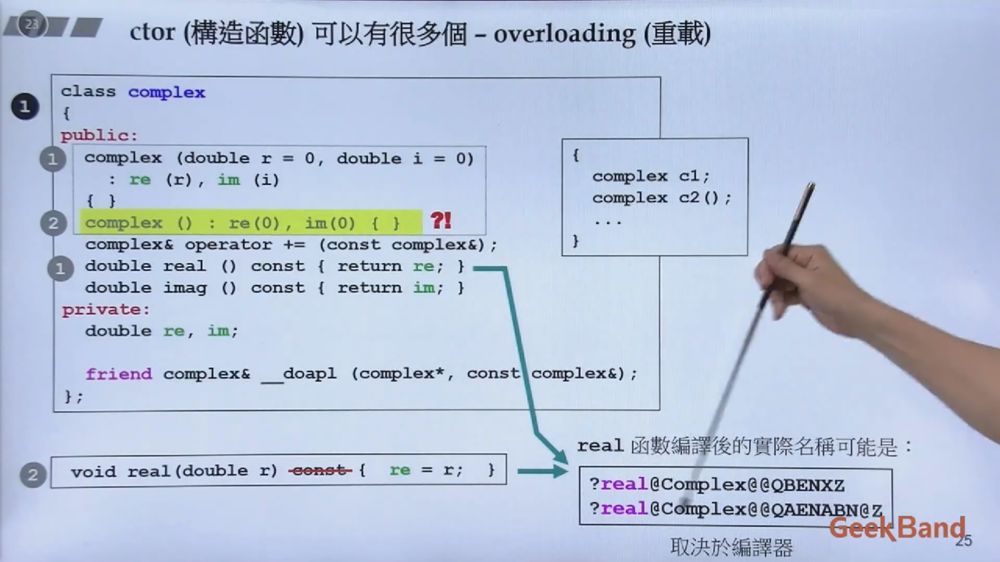

# 复习总结已学

## 复数的加法重载

```c++
complex c1(2.5,3.4);
complex c2(3);

c1 += c2;
```

其中+=需要重载，成员函数 operator+=内部this指针指向c1.

```c++
/* 注意事项：
 *  1. 参数传递与返回均使用引用是为了不进行cp节省开销
 *  2. 单独将加法操作作为一个函数是因为可能其他函数会用到这一功能（__doapl f）
 *  3. __doapl 即 do assignment plus(assignment plus即+=)
 *  4. __doapl f返回*this是返回value，并非返回pointer，这样就无需考虑返回类型是value还是reference了（即complex和complex&都可以）
 *  5. operator+=返回并不为void，是考虑到[c3+=c2+=c1]的可能
 */
inline complex&
complex::operator += (const complex& r)
{
    return __doapl(this, r);
}

inline complex&
__doapl(complex* ths, const complex& r)
{
    ths->re += r.re;
    ths->im += r.im;

    return *this;
}
```

## class的构造函数
```c++
template<typename T>
class complex
{
public:
    //ctor function
    complex (T r = 0, T i = 0)
    : re(r), im(i) //初始列/初值列
    {}
    T complex& operator += (const complex& r);
    // two inline function
    T real() const { return re;} //const function不会改变value
    T imag() const { return im;}
private:
    T re;
    T im;
}
```

## 一些要点
一般赋值有两个阶段：（1）初始化，即re(r)（2）赋值 (re = r)
直接采用（1）的方式效率更高

C++的函数重载意味着函数名和返回值类型相同，但是参数个数和/或类型不同。


real()和imag()函数之所以要加const，一方面是如果出现
```c++
const complex c1(2,1)
or
inline double
real (const comlpex& r)
{
    return r.real();
}
```
的定义，如果调用real和imag不加const就会报错，因为存在可能修改常量的可能。

析构函数ctor作为private存在，不允许外部生成类的情况：singleton


相同class各个object互为友元，也就是相同class可以直接访问到同样class的另一个实例的object，即使为private。
