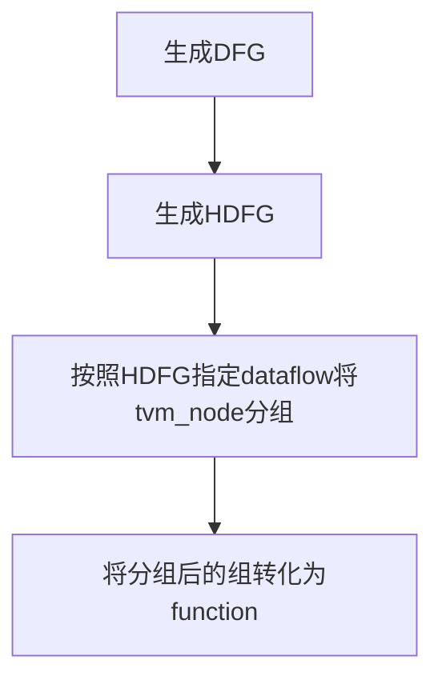
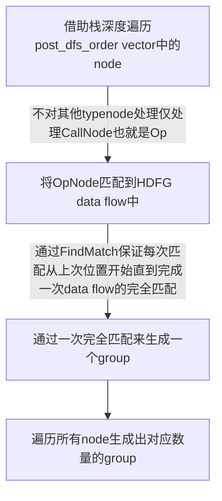

# fuse_op_hw Pass HW算子融合逻辑


## 总貌
tvm前端解析出来网络module并转化为Relay IR后，fuse_op_hw Pass做了以下几件事：



其中
| class           | class annotation                                                         |
| --------------- | ------------------------------------------------------------------------ |
| DFG             | data flow graph，用来作为tvm node和HDFG node之间的过渡，是tvm node的映射 |
| Creator         | DFG用来完成node映射的helper class                                        |
| HDFG            | Hardware data flow graph，将tvm IR转化为指定OPU的IR，并进行对node的分组  |
| GraphMatchFuser | 用来完成node fusion并将group转化为function的helper class                 |

| function                       | function annotation                                                                                                 |
| ------------------------------ | ------------------------------------------------------------------------------------------------------------------- |
| DFG::Creator::Prepare          | 完成tvm node到DFG node的映射，分三步：建立映射表、遍历每个node并根据类型映射、更新node父子关系                      |
| DFG::Creator::VisitExpr_       | 自定义重载func，通过自定义AddNode来完成对tvm node的遍历和DFG node的映射                                             |
| HDFG::Create                   | 定义指定的data flow（该data flow便是一个组，例如cc中的data flow只允许存在一个pad，第二个pad将被归为第二组）         |
| GraphMatchFuser::Partition     | 算子融合func，采用dfs贪心尽可能多的将node归为一个group                                                              |
| HDFG::FindMatch                | 广度遍历后序树，input为DFG node，return为bool_match，side effect为修改last_match值以完成一趟hardware data flow      |
| GraphMatchFuser::CollectInputs | 向上递归，将没有算进来的结点归为该group（例如constant等节点为新分支节点，没办法向下遍历时访问到，只能通过向上遍历） |

## Partition function细节分析
tvm的fuse_op使用了支配树来定义group division rule，而OPU通过定义hardware data flow来确定分组的规则，hardware data flow在Create func中定义：
```c++
  // describe data flow
  hdfg.root = concat;
  hdfg.LinkFromTo(concat, add_pre); // concat -> add_pre
  hdfg.LinkFromTo(add_pre, mul_pre);
  hdfg.LinkFromTo(mul_pre, pad);
  hdfg.LinkFromTo(pad, ipa);
  hdfg.LinkFromTo(ipa, mul);
  hdfg.LinkFromTo(mul, add);
  hdfg.LinkFromTo(add, compare);
  hdfg.LinkFromTo(add, pool_pad);
  hdfg.LinkFromTo(add, res_add);
  hdfg.LinkFromTo(pool_pad, pool);
  hdfg.LinkFromTo(compare, pool);
  hdfg.LinkFromTo(compare, res_add);
  hdfg.LinkFromTo(pool, compare);
  hdfg.LinkFromTo(pool, res_add);
  hdfg.LinkFromTo(res_add, compare);
  hdfg.LinkFromTo(res_add, pool);
  hdfg.LinkFromTo(compare, upsample);
  hdfg.LinkFromTo(pool, upsample);
  hdfg.LinkFromTo(res_add, upsample);
  ...
```
可以得知data flow中padding和IPA(即conv2d)仅出现一次，故每一group中仅有一个pad，这在该data_flow中是关键信号。

Partition function整体逻辑flow如下：


而对于除了CallNode之外的类似VarNode、ConstantNode，均在AddToGroup func中的CollectInputs func中完成，CollectInputs func完成这样的操作：
```c++
void GraphMatchFuser::AddToGroup(DFG::Node* node, Group* grp) {
  gmap_[node->ref] = grp;
  // update group root with the latest operator node (post dfs order)
  grp->root_ref = node->ref;
  // add all ungrouped preds
  // aim to collect nodes that cannot be mapped via hdfg.op_map
  // e.g. tuple, const, expand_dims
  // counterexample: tuple has 2 relu inputs, which are not considered below,
  // since they should be captured in the Partition() flow
  // 这是一个向上看的过程，从Op node开始将他上面的node均判断一遍
  for (auto pred : node->pred) {
    CollectInputs(pred, grp);
  }
}

/*
 * 向上递归的过程，将上面没有算进来的结点归为该group，
 * 例如constant等节点为新分支节点，没办法向下遍历时访问到，只能通过向上遍历
 * recursively add inputs of DFG:Node to target group
 * terminate until 
 *   1. a root DFG::Node from other group is met 
 *   2. a grouped DFG::Node is met
 *   3. a ungrouped DFG::Node, which is a CallNode and will be grouped later
 */
void GraphMatchFuser::CollectInputs(DFG::Node* node, Group* grp) {
  auto it = root_map.find(node->ref);
  if (it != root_map.end()) {
    return;
  } else if (gmap_.find(node->ref) != gmap_.end()) {
    return;
  } else {
    if (node->ref->IsInstance<TupleNode>()) {
      os << "tuple\n";
    } else if (node->ref->IsInstance<ConstantNode>()) {
      os << "const\n";
    } else if (node->ref->IsInstance<CallNode>()) {
      const CallNode* call = static_cast<const CallNode*>(node->ref);
      os << call->op << "\n";
      if (call->op.get()->IsInstance<OpNode>()) {
        // Operators in op_map will be taken care of in Partition()
        const OpNode* op = static_cast<const OpNode*>(call->op.get());
        auto ie = hdfg.op_map.find(op->name);
        if (ie != hdfg.op_map.end()) {
          return;
        }
      }
    } else if (node->ref->IsInstance<VarNode>()) {
      os << "var\n";
    } else {
      os << "unknown\n";
    }
    gmap_[node->ref] = grp;
    os << "## " << node->index << ": added to group " << grp->index
       << " via CollectInputs() \n";
  }
  for (auto pred : node->pred) {
    CollectInputs(pred, grp);
  }
}
```
每次访问到一个OpNode时，通过pred关系向上递归遍历其他类型node，将这些node归为这个OpNode所在group。
Partition中便通过这样的方式完成group分组：
```c++
    //只对Op_node进行操作，遇到其他类型node直接跳过，
    //比如刚开始跳过node[0]直接到node[1]:Op(nn.pad)，
    //在CollectInputs中将node[0]collect进来。
    if (node->ref->IsInstance<CallNode>()) {
      const CallNode* call = static_cast<const CallNode*>(node->ref);
      std::string opname = call->op.as<OpNode>()->name;
      //从last_match开始是因为在HDFG中定义了一块data_flow，
      //这一块data_flow便定义了一组可能的group，
      //所以会有没有find(因为一趟已经结束了)但是是能够找到Op的情况，这时候说明要开新group了。
      bool find = hdfg.FindMatch(node);
      auto it = hdfg.op_map.find(opname);
      if (find) {
        // mapped to hardware successfully, add to current group
        grp = GetLatestGroup();
        AddToGroup(node, grp);
        os << "## " << node->index << ": " << call->op
           << " added to group " << grp->index << "\n";
      } else if (it != hdfg.op_map.end()) {
        // primitive operator nodes cannot be mapped to hardware data flow
        // try restart mapping (bfs matching) from source of hardware data flow
        hdfg.last_match = nullptr;
        find = hdfg.FindMatch(node);
        if (find) {
          // successfully mapped after from hardware source
          // add node to a new group
          grp = GetLatestGroup(true);
          AddToGroup(node, grp);
          os << "## " << node->index << ": " << call->op
             << " added to group " << grp->index << "\n";
        }
      }
      ...
```