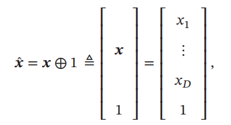
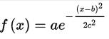
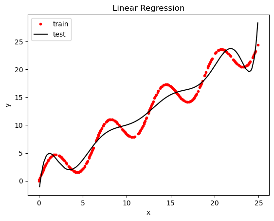
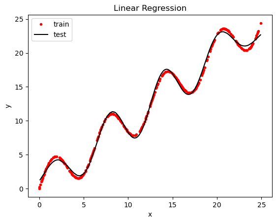
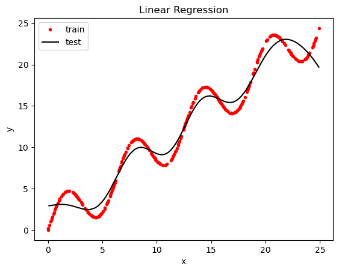

# nndl总笔记

## chap2 线性回归

exercise中需要写的两部分：基函数与w的优化实现。

基函数分为两块，多项式基函数和高斯基函数，多项式基函数是将样本的表示维度即特征提升至`feature_num`个，构造出长度为`feature_num`的特征向量，并且泛化成增广特征向量后其长度为`feature_num+1`，如图所示：



代码如下：

```python
def multinomial_basis(x, feature_num):
    x = np.expand_dims(x, axis=1) # shape(N,1) 将一维x扩展至二维，第二维即特征向量的长度
    feat = [x] # 'numpy.ndarray' object has no attribute 'append' 必须转化为list
    for i in range(feature_num+1):
        feat.append(x**i)
    res = np.concatenate(feat, axis=1)
    return res
```


高斯基函数即高斯函数，其数学定义式如下：



其中a，b，c均为参数，在nndl中按如下方式定义：

```python
def gaussian_basis(x, feature_num):
    x = np.expand_dims(x, axis=1)
    '''以下定义高斯函数参数的方式只是一种，并不是唯一的方式，选择的参数也不是唯一的''' 
    centers = np.linspace(0, 25, feature_num) #在(0,25)区间均等划分feature_num个区域，已每个区域的左边界作为高斯函数的一个均值，共生成feature_num个均值，由此构造出特征向量，此处(0,25)区间的选择是因为训练集的x的范围在0-25之间
    width = 1.0 * (centers[1] - centers[0]) #将均等分的长度作为方差
    
    ''' 构造x, eg: x=[2,3,5,6,8]
    array([[2, 2, 2, 2, 2, 2, 2, 2, 2, 2],
       	   [3, 3, 3, 3, 3, 3, 3, 3, 3, 3],
           [5, 5, 5, 5, 5, 5, 5, 5, 5, 5],
       	   [6, 6, 6, 6, 6, 6, 6, 6, 6, 6],
       	   [8, 8, 8, 8, 8, 8, 8, 8, 8, 8]])
    '''
    x = np.concatenate([x]*feature, axis=1)
    
    '''通过broadcast方式进行高斯函数构造，参照上述公式'''
    out = (x-centers)/width
    ret = np.exp(-0.5 * out**2)
    return ret
```

基于两种基函数，有两种w的优化方式：最小二乘和梯度下降两种。其中最小二乘直接按照公式表示即可：

```python
# fn x N x N x fn x fn x N x N x.
w = np.dot(np.dot(np.linalg.inv(np.dot(phi, phi.T)), phi), y_train)
'''最小二乘法并非如梯度下降般通过训练来求得最优解，而是直接通过数学计算计算出最优解'''
```

基于最小二乘的拟合结果如下：

【多项式 + 最小二乘】标准差：1.5



【高斯 + 最小二乘】标准差：0.4



w的第二种优化方法为梯度下降法，该梯度下降法无需写出自定义的loss_function，再采取微分求导的方式，而是直接利用最小二乘的公式直接手动给出求导后的结果：

```python
'''method2 梯度下降'''
training_loop = 10000
learning_rate = 0.001

w = np.zeros(phi.shape[0])
for j in range(training_loop):
# fnx1 + fnxNxNx1
   for i in range(len(x_train)):
      w = w + learning_rate * np.dot(phi.T[i], (y_train[i] - np.dot(phi.T[i], w)) )
```

基于梯度下降的拟合结果如下：

【多项式 + 梯度下降】

ERROR：出现问题，目前只能使用高斯和identity_basis

【高斯 + 梯度下降】training_loop：10000 ，标准差：1.1



【高斯 + 梯度下降】training_loop：100000 ，标准差：0.4


## Chap3 线性模型

